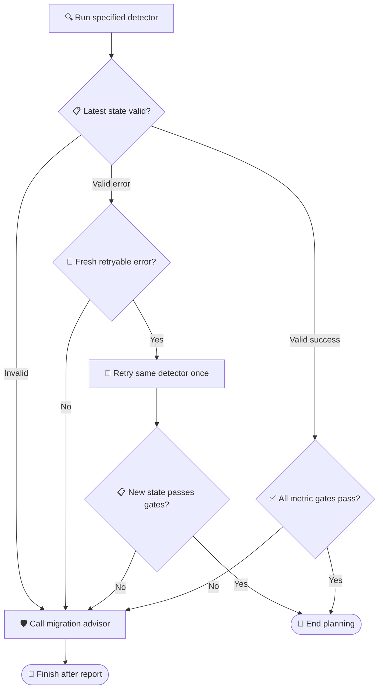

# Planner retry/migrate V6 dataset card

_Entity-disjoint SFT → GRPO → final-evaluation corpus, frozen 2026-07-15_

---

## 📋 Summary

`planner_retry_migrate_v6` replaces V5 as the primary dataset family for learning and measuring the retry-versus-migrate state transition. It contains **1,875 full cases over 250 disjoint entities**, plus Qwen3.5-native stage artifacts for SFT and GRPO. No optimizer training was run while creating this dataset.

The defining change is a matched counterfactual design. For each core `(entity, detector, error_alias)` bundle, three cases keep the query, entity, detector, error spelling, badge condition, target, and image fixed while changing only the routing state:

1. `retryable=true, retry_count=0` → retry the same detector once
2. `retryable=false, retry_count=0` → call `migration_advisor`
3. `retryable=true, retry_count>=1` → call `migration_advisor`

The machine-readable source of truth is [manifest.json](manifest.json). Detailed diagnostics are in [audit_report.json](audit_report.json) and [eda_summary.json](eda_summary.json).

## 📊 Split inventory

| Split | Entities | Full cases | Core / guard | Frozen stage rows |
| --- | ---: | ---: | ---: | ---: |
| `sft_train` | 80 | 600 | 480 / 120 | 1,040 |
| `sft_dev` | 20 | 150 | 120 / 30 | 260 |
| `grpo_train` | 60 | 450 | 360 / 90 | 360 core step-2 prompts |
| `grpo_dev` | 30 | 225 | 180 / 45 | 180 core step-2 prompts |
| `test` | 60 | 450 | 360 / 90 | Not materialized for training |

The guard set is exactly 25% of the core-case count. It covers clean success, metric vetoes, missing state, conflicting state, stale-history conflicts, and post-retry outcomes. The SFT artifact deduplicates identical prompt/completion pairs produced by the shared first probe in each matched triple; 1,360 source decisions therefore become 1,040 unique SFT-train rows.

## 🎯 Decision contract

Every full trajectory starts with the detector explicitly requested by the query. The maximum trajectory length is three decisions.



The success gates are `candidate_count>=1`, `min_confidence>=0.88`, `cross_prompt_iou>=0.72`, and `domain_shift=low`. Missing, malformed, or conflicting fields take the conservative migration branch. A retry is never allowed twice.

## ⚙️ Experimental design

### Experimental unit

The independent comparison unit is the **counterfactual bundle**, not an individual row. Each bundle contains one retry label and two migrate labels under identical nuisance conditions. Evaluation should aggregate or bootstrap by `entity_id` or `counterfactual_bundle_id`; treating all rows as independent would overstate precision.

### Blocking and nuisance control

- Query text, entity, detector, target, fixture, error alias, and badge are blocked within every core triple
- Badge conditions rotate among `red`, `amber`, and missing, but each condition appears with both actions
- Error aliases are split-specific and each alias appears with both actions
- Post-retry outcomes rotate among success, metric veto, and another technical error
- Detector families are balanced, with only a one-case difference where a split size prevents exact equality
- Seed `2026071506` freezes entity order, guard allocation, aliases, and fixture generation

On core cases, badge/action mutual information is zero to floating-point tolerance in every split; error-alias/action mutual information is likewise zero to tolerance.

## 💾 Files and roles

### Full case files

The canonical case JSONLs live under `training/planner_grpo_seed_v1/cases/`:

- `planner_retry_migrate_v6_sft_train_cases.jsonl`
- `planner_retry_migrate_v6_sft_dev_cases.jsonl`
- `planner_retry_migrate_v6_grpo_train_cases.jsonl`
- `planner_retry_migrate_v6_grpo_dev_cases.jsonl`
- `planner_retry_migrate_v6_test_cases.jsonl`

### Stage artifacts

- SFT: `training/planner_grpo_seed_v1/sft_data_planner_retry_migrate_v6_qwen35_nothinking/{train,dev}.jsonl`
- GRPO: `training/planner_grpo_seed_v1/step_data/planner_retry_migrate_v6_grpo_{train,dev}_qwen35_4b_nothinking_step2.jsonl`
- Builder: `training/planner_grpo_seed_v1/scripts/build_planner_retry_migrate_v6.py`

All stage prompts use the local Qwen3.5 chat template with `enable_thinking=false`, `max_steps=3`, EOS ID `248046`, and PAD ID `248044`.

## 🔐 Leakage controls

All five splits are disjoint on case ID, entity ID, project entity, target entity, normalized query, template ID, non-sentinel error alias, fixture family, fixture path, and fixture content hash. The same protected fields also have zero overlap with every other case JSONL found in the repository during the frozen build.

Frozen prompts contain none of the following:

- Case IDs or entity IDs
- Absolute `/raid/` or `/tmp/` paths
- `external_ref` or `_thought` persistence fields
- The old phrase `按训练样本期望执行该工具`
- A misleading global `max_steps=10`

The `test` split is marked `sealed=true`, `evaluation_only=true`, and `exclude_from_training=true`. Its prompt artifact is deliberately not generated.

## 🔄 Intended stage order

1. Train only on `sft_train`; use `sft_dev` for SFT selection
2. Freeze the chosen SFT checkpoint and evaluate the untouched V6 dev/test protocol as planned
3. Optimize only on the 360 `grpo_train` core transition prompts
4. Use `grpo_dev` for support and model-selection gates
5. Run the sealed V6 `test` split once for the final comparison

V5 should remain a legacy diagnostic/regression set. It should not be used as the final claim set because its confirmation split contains a badge shortcut and lacks within-entity action counterfactuals.

## ⚠️ Limitations

- The routing policy and tool observations are synthetic, even though they are structurally matched and auditable
- The system prompt is long, so frozen prompts are approximately 4.1k–4.6k tokens
- The independent 45-case human review sample is prepared but still marked pending in [human_review_sample.jsonl](human_review_sample.jsonl)
- The final test is sealed by role flags and hashes, not by access control; operators must enforce process separation
- These files establish data correctness and reward compatibility, not model learnability; base/SFT support must still be measured before GRPO

## 🔧 Reproduction

Run the deterministic builder from the repository root:

```bash
.venv-qwen35-grpo/bin/python \
  training/planner_grpo_seed_v1/scripts/build_planner_retry_migrate_v6.py
```

The build fails on entity/content overlap, malformed trajectories, missing second observations, reward mismatch, prompt artifacts, duplicated frozen prompts, or prompt length above 4,608 tokens.
