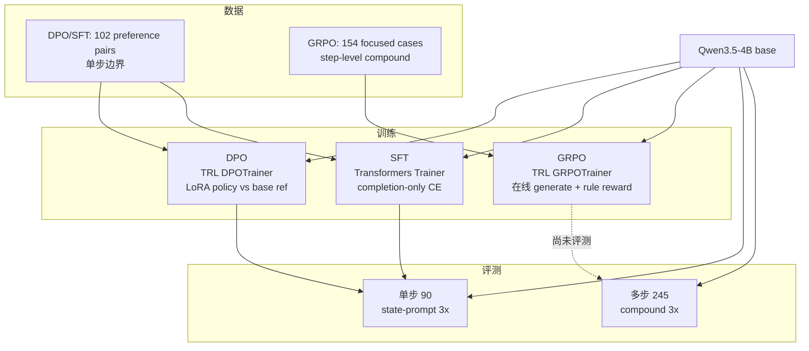

# CAPA Planner 训练技术选型（SFT / DPO / GRPO）

本文档汇总 CAPA 项目在 **Qwen3.5-4B Planner 路由** 上已尝试的三种训练路线技术细节，供实验设计与复现参考。正式评测协议见 `EVALUATION_POLICY.md`；active 结果台账见 `EXPERIMENT_LOG.md`。

---

## 1. 总览对比

| 维度 | SFT | DPO | GRPO |
|---|---|---|---|
| **训练目标** | 监督模仿 chosen 答案 | 偏好对齐（chosen > rejected） | 在线生成 + 规则 reward 优化 |
| **任务范围** | 单步路由边界 | 单步路由边界 | 多步 compound 状态转移 |
| **框架** | Transformers `Trainer` | TRL `DPOTrainer` | TRL `GRPOTrainer` |
| **参数模式** | LoRA | LoRA | LoRA（单卡）或全参 FSDP（4 卡） |
| **Ref 模型** | 无 | **base 4B（LoRA 关闭）** | 无显式 ref（group relative） |
| **数据规模** | 102 train / 11 val | 102 train / 11 val | focused **154 cases → 245 step 样本 → ~122 optimizer steps/epoch** |
| **是否有训后 formal eval** | 有（旧协议单步 90） | 有（旧协议单步 90） | **尚无**（LoRA / 全参 checkpoint 均未跑 compound eval） |

### 1.1 选型结论（截至 2026-07-08）

- **DPO**：单步路由里唯一验证有效的对齐方案（`64/90`，相对 base 净增约 2 条）。
- **SFT**：同数据下 **不优于 DPO**（`62/90`），除非扩充 `general_answer` 等 hard negative。
- **GRPO**：方向正确（对准 compound / `probe_then_migration`），但被 TRL 在线 `generate()` 显存峰值卡住；LoRA 进度最远（66/122 step，`checkpoint-50` ~56M）。

---

## 2. 训练与评测数据

### 2.1 数据规模一览

| 用途 | 文件 | 规模 | 用于 |
|---|---|---:|---|
| DPO / SFT **训练** | `training/planner_dpo_train_seed_v1/training_data/planner_dpo_text_train.jsonl` | **102** 条 preference pair | SFT 取 `prompt+chosen`；DPO 取 `prompt+chosen+rejected` |
| DPO / SFT **验证** | `.../planner_dpo_text_val.jsonl` | **11** 条 | 训练时 eval loss |
| GRPO **全量 compound 池** | `training/planner_grpo_seed_v1/cases/planner_grpo_train_cases.jsonl` | **313 cases**，展开 **404 step 行** | 回归评测源文件；**不是** 4B 首轮 GRPO 训练集 |
| GRPO **focused 训练集** | `.../planner_grpo_focused_4b_cases.jsonl` | **154 cases**，展开 **245 step 行** | 4B LoRA / 全参 GRPO **实际训练** |
| **单步评测** | `training/planner_dpo_train_seed_v1/eval/planner_routing_eval_90cases.json` | **90 cases** | SFT / DPO 训后对比；base formal 单步基线 |
| **多步 compound 评测** | 从 `planner_grpo_train_cases.jsonl` 清洗出的子集 | **245 cases** | base / 训后 compound formal eval（3× aggregate） |

**GRPO 训练到底有多少条？**

- **Case 级**：focused **154** 个多步场景（每个 case 含 1～2 步 `expected_decisions`）。
- **Step 级（实际喂给 GRPOTrainer 的样本）**：展开后 **245** 行——每个 step 一行，前面步骤用 mock session 回放拼成 state-prompt。
- **Optimizer step 级（日志里的 122）**：LoRA 跑 1 epoch 显示 `66/122`，因为 TRL GRPO 每个 step 样本要在线采样 `num_generations=4` 条 completion，再按梯度累积合并：

  `optimizer_steps ≈ step_samples × num_generations / gradient_accumulation_steps = 245 × 4 / 8 ≈ 122`

  所以 **122 不是 case 数，也不是 245 step 行数**，而是「带 group sampling 的优化步数」。

### 2.2 什么叫 Focused（GRPO 专用）

**Focused** 是从全量 **313** 个 compound case 里筛出来的 **154** 个 **soft boundary** 子集，专门给 4B GRPO 训练用；设计原则是：**DPO/SFT/规则已经能搞定的单步边界不要重复训，GRPO 只攻多步状态转移和仍易错的 guardrail**。

构建脚本：`training/planner_grpo_seed_v1/scripts/build_planner_grpo_focused_cases.py`  
数据报告：`training/planner_grpo_seed_v1/reports/planner_grpo_focused_4b_data_report.json`

| 筛选维度 | 数量 | 含义 |
|---|---:|---|
| `probe_then_migration` + `probe_then_migration_strict` | **91** | 先 `qwen_detection`（`finish_after_tool=false`）→ 再 `migration_advisor` |
| `probe_only_contrastive` | **30** | 只要探针、不要误走 pipeline / migration |
| `clarify_intent_ambiguity` | **8** | 意图歧义必须先 clarify |
| guardrail 补充 | **25** | `single_image_probe`(12)、`full_detection_eval`(5)、`general_answer`(4)、`historical_asset_qa`(4) |

报告里的 `intended_use` 写得很直白：**全量 `planner_grpo_train_cases.jsonl` 做 regression eval，focused 做 4B 首轮 GRPO train mix**。

### 2.3 训练数据样例

#### DPO 训练样例（`DPO-VIS-001`）

单步路由 preference pair：`chosen` 走轻量 detection，`rejected` 误走完整 pipeline。

```json
{
  "meta": { "case_id": "DPO-VIS-001", "category": "executable_vision_probe" },
  "prompt": "<|system|>…Planner 系统提示…<|user|>…\n{\n  \"query\": \"帮我看这张图里有没有垃圾车。\",\n  \"image_available\": true,\n  \"image_filename\": \"trash_truck.jpg\",\n  \"query_trajectories\": []\n}\n<|assistant|>\n",
  "chosen": "{\"thought\": \"用户只要求对当前图片做单步目标检测…\", \"decision_type\": \"tool\", \"action\": \"qwen_detection\", \"action_input\": {\"label\": \"垃圾车\", \"finish_after_tool\": true}, \"final_answer\": \"\"}",
  "rejected": "{\"thought\": \"用户提出了目标检测需求，适合调用完整视觉评估流水线…\", \"decision_type\": \"tool\", \"action\": \"pipeline_eval\", \"action_input\": {\"task_text\": \"帮我看这张图里有没有垃圾车。\", \"finish_after_tool\": true}, \"final_answer\": \"\"}"
}
```

完整文件：`training/planner_dpo_train_seed_v1/training_data/planner_dpo_text_train.jsonl`

#### SFT 训练样例（同 `DPO-VIS-001`，仅保留 chosen）

SFT 与 DPO **同源 102 条**，只是丢弃 `rejected`，做 completion-only CE：

```json
{
  "prompt": "<|system|>…<|user|>…{\"query\": \"帮我看这张图里有没有垃圾车。\", \"image_available\": true, …}<|assistant|>\n",
  "chosen": "{\"thought\": \"用户只要求对当前图片做单步目标检测…\", \"decision_type\": \"tool\", \"action\": \"qwen_detection\", \"action_input\": {\"label\": \"垃圾车\", \"finish_after_tool\": true}, \"final_answer\": \"\"}"
}
```

#### GRPO 训练样例（focused case `GRPO-OBS-001`）

多步 compound：第 1 步探针 **`finish_after_tool=false`**，第 2 步才进 `migration_advisor`。训练时按 step 拆成 2 行，第 2 行的 prompt 会带上第 1 步 mock 回放后的 state。

```json
{
  "case_id": "GRPO-OBS-001",
  "category": "probe_then_migration",
  "user_query": "这张图里有没有钓鱼的人？先用已有模型试一下。如果结果不确定，再给客户一个低成本验证方案。",
  "setup": { "has_image": true, "image_fixture": "examples/images/fisherman.jpg" },
  "expected_decisions": [
    {
      "step": 1,
      "action": "qwen_detection",
      "required_args": { "finish_after_tool": false },
      "arg_contains": { "label": ["钓鱼", "人"] }
    },
    {
      "step": 2,
      "action": "migration_advisor",
      "required_args": { "use_image": true, "use_visual_probe": true, "finish_after_tool": true },
      "arg_contains": { "user_query": ["钓鱼", "低成本验证"] }
    }
  ],
  "forbidden_actions": ["pipeline_eval", "answerer"],
  "reward_spec": {
    "json_valid": 0.1, "decision_type_valid": 0.1, "action_match": 0.35,
    "argument_match": 0.25, "finish_after_tool": 0.1, "no_forbidden_action": 0.1
  }
}
```

完整文件：`training/planner_grpo_seed_v1/cases/planner_grpo_focused_4b_cases.jsonl`（154 cases → 245 step 训练行）

### 2.4 评测数据样例

#### 单步评测 90 cases（`ROUTE-RAG-001`）

SFT / DPO 训后用的旧协议单步集；只判 **当前一步** 的 `primary_action` 与 slot，不涉及多步状态。

```json
{
  "case_id": "ROUTE-RAG-001",
  "category": "historical_asset_qa",
  "user_query": "目前安全绳检测有哪些模型和版本？",
  "setup": { "has_image": false },
  "expected": {
    "primary_action": "rag_answer",
    "required_slots": { "query_contains": ["安全绳", "模型"] },
    "forbidden_actions": ["adela_cli_eval", "pipeline_eval", "qwen_detection", "rexomni_detection"]
  },
  "reason": "用户在问内部历史资产和版本，应该检索知识库，而不是触发部署评测或视觉探针。"
}
```

完整文件：`training/planner_dpo_train_seed_v1/eval/planner_routing_eval_90cases.json`

#### 多步 compound 评测 245 cases（同结构，例 `GRPO-OBS-001`）

Formal compound eval 从全量 313 cases 清洗出 **245** 个；结构与 GRPO 训练 case 相同，但 **评测集 ⊃ 训练 focused 集**（训练 154 case 是其中子集）。指标是 **case 级 pass-all**（每步都对才算过），通常跑 3 轮取 aggregate。

样例字段与 §2.3 GRPO 训练样例相同（`expected_decisions` 逐步校验 + `forbidden_actions` + `reward_spec`）。  
Aggregate 报告：`training/planner_grpo_seed_v1/reports/repro_eval/qwen35_4b_grpo_compound245_stateprompt_t60_3x_aggregate.json`

---

## 3. 共用基础

### 3.1 Base 模型

- 路径：`/mnt/zkq/models/Qwen3.5-4B`
- 备份（全参 GRPO 长跑前）：`/mnt/zkq/models/Qwen3.5-4B.backup-20260708`
- 训练写独立 `outputs/...`，不覆盖 base

### 3.2 LoRA 默认配置（SFT / DPO / GRPO LoRA 共用）

| 项 | 值 |
|---|---|
| `r` | 16 |
| `alpha` | 32 |
| `dropout` | 0.05 |
| `target_modules` | `q_proj,k_proj,v_proj,o_proj` |
| `bias` | none |
| `task_type` | CAUSAL_LM |

### 3.3 训练环境

| 用途 | 环境 | PyTorch | 说明 |
|---|---|---|---|
| SFT / DPO / GRPO LoRA | `.venv-train` | 2.8.0+cu128 | 单卡可用 |
| GRPO 全参 FSDP | `.venv-train-cu124` | 2.6.0+cu124 | 多卡 NCCL；cu128 在 CUDA 12.4 驱动上会失败 |

### 3.4 通用工程设置

- `torch.backends.cudnn.enabled = False`（规避 V100 cuDNN 问题）
- `PYTORCH_CUDA_ALLOC_CONF=expandable_segments:True`
- `TOKENIZERS_PARALLELISM=false`（GRPO）

---

## 4. DPO

### 4.1 目的

用人工审核的 **preference pairs** 纠正单步 Planner 的三类路由边界，不覆盖多步 workflow。

### 4.2 代码与启动

| 项 | 路径 |
|---|---|
| 训练脚本 | `demo/eval/train_planner_dpo.py` |
| 启动脚本 | `scripts/run_qwen35_4b_dpo.sh` |
| 数据包 | `training/planner_dpo_train_seed_v1/` |
| 已跑产物 | `outputs/planner-dpo-qwen35-4b-newarch-lora` |
| 实验记录 | `experiments/runs/2026-06-24_dpo_newarch/` |

### 4.3 数据

来源：`training/planner_dpo_train_seed_v1/training_data/planner_dpo_text_{train,val}.jsonl`  
**完整样例见 §2.3（`DPO-VIS-001`）**；单步评测样例见 §2.4（`ROUTE-RAG-001`）。

格式：

```json
{
  "prompt": "...完整 Planner 路由 prompt...",
  "chosen": "{...正确 Planner JSON...}",
  "rejected": "{...错误 Planner JSON...}",
  "meta": {}
}
```

规模与分布（113 approved → 102/11 split）：

| 边界类型 | 数量 |
|---|---:|
| `answerer > rag_answer` | 33 |
| `qwen_detection > pipeline_eval` | 40 |
| `rag_answer > migration_advisor` | 40 |

**明确排除**：Adela 解析/澄清状态机、多步 compound workflow、公司政策类问题。

### 4.4 Ref 是谁？

代码显式传入 `ref_model=None`：

```python
trainer = DPOTrainer(
    model=model,
    ref_model=None,
    peft_config=peft_config,
    ...
)
```

因 `use_lora=true`，TRL 使用 **PEFT implicit reference**：

| 角色 | 实际含义 |
|---|---|
| **Policy** | `Qwen3.5-4B` base + **可训练 LoRA** |
| **Ref** | **同一 base 权重，forward 时关闭 LoRA adapter** |

要点：

- **不单独加载第二份 ref checkpoint**
- Ref = 训练开始时的 **frozen base 4B**
- Ref **全程不更新**（LoRA 模式不支持 `sync_ref_model`）
- Ref forward 在 `torch.no_grad()` 下，adapter disabled，计算 chosen/rejected 的 reference log prob

### 4.5 损失函数

- TRL 标准 DPO，`f_divergence_type="reverse_kl"`（默认）
- **`beta = 0.1`**
- 对每个 pair 优化：相对 ref，policy 更偏好 chosen、更不偏好 rejected
- 只在 **completion 段** 比较 log prob；prompt 由 TRL mask

### 4.6 超参数（4B shell 实际值）

| 项 | 值 |
|---|---|
| `learning_rate` | 5e-6 |
| `num_train_epochs` | 1 |
| `per_device_train_batch_size` | 1 |
| `gradient_accumulation_steps` | 8 |
| 有效 batch | **8 pairs / optimizer step** |
| `max_length` | 1024 |
| `max_prompt_length` | 768 |
| `max_completion_length` | 256 |
| `truncation_mode` | `keep_end` |
| `fp16` / `bf16` | false / false → **fp32** |
| `gradient_checkpointing` | true |
| `optim` | adamw_torch |
| GPU | 单卡（默认 `CUDA_VISIBLE_DEVICES=1`） |
| `save_steps` | 25 |
| `eval_steps` | 10 |

脚本 default 的 LoRA target 还包含 MLP（`gate_proj,up_proj,down_proj`），4B shell **收窄为仅 attention 投影**。

### 4.7 评测结果

- 协议：旧版单步 90 cases（非当前 state-prompt 3× formal）
- 结果：**64/90 (0.7111)**
- 相对 base ~62/90 净增约 2 条；主要改善 historical 与少量 vision
- train_loss ≈ 0.65，runtime ≈ 862s

---

## 5. SFT

### 5.1 目的

验证：**只用 DPO 的 chosen response 做监督**，能否达到或超过 DPO。

### 5.2 代码与启动

| 项 | 路径 |
|---|---|
| 训练脚本 | `demo/eval/train_planner_sft.py` |
| 启动脚本 | `scripts/run_qwen35_4b_sft_multigpu.sh` |
| 数据 | 与 DPO 同源（仅 `prompt + chosen`） |
| 产物 | `outputs/planner-sft-qwen35-4b-chosen-lora` |
| 实验记录 | `experiments/runs/2026-07-03_sft_chosen/` |

### 5.3 数据与 loss

- 字段：`prompt`, `chosen`（丢弃 `rejected`）——与 DPO **同源 102 条**；**样例见 §2.3**
- **Completion-only SFT**：
  - `input_ids = prompt_ids + completion_ids`
  - `labels = [-100] * len(prompt) + completion_ids`
  - 只在 assistant JSON 段算 cross-entropy

### 5.4 Ref

无。标准 causal LM 监督，不涉及 reference model。

### 5.5 超参数（4B shell 实际值）

| 项 | 值 |
|---|---|
| `learning_rate` | **1e-5**（比 DPO 高 2×） |
| `num_train_epochs` | 1 |
| `per_device_train_batch_size` | 1 |
| `gradient_accumulation_steps` | **1** |
| `max_length` | 1024 |
| `fp16` / `bf16` | false / false → **fp32** |
| `gradient_checkpointing` | true |
| LoRA | 同 DPO（r=16, q/k/v/o） |
| 分布式 | **5 卡 DDP**（`torchrun`, `nproc=5`） |
| `ddp_backend` | **`gloo`**（绕过 NCCL cu128/驱动不匹配） |
| GPU | 默认 `CUDA_VISIBLE_DEVICES=2,3,5,6,7` |

### 5.6 评测结果

- 单步 90：**62/90 (0.6889)** — 与 base 持平，**低于 DPO**
- train_loss ≈ 2.08，runtime ≈ 114s
- 结论：后续不应单纯沿用 chosen-only SFT，除非扩充数据

---

## 6. GRPO

### 6.1 目的

优化 **多步 compound Planner 状态转移**，尤其 `detection probe → migration_advisor`；单步边界已由 DPO/SFT 覆盖，GRPO focused 集刻意避开已较好解决的区域。

### 6.2 代码与启动

| 项 | 路径 |
|---|---|
| 训练脚本 | `training/planner_grpo_seed_v1/scripts/train_planner_grpo.py` |
| LoRA 启动 | `scripts/run_qwen35_4b_grpo_focused.sh` |
| 全参 FSDP 启动 | `scripts/run_qwen35_4b_grpo_fullparam_fsdp.sh` |
| Reward | `training/planner_grpo_seed_v1/scripts/reward_planner_grpo.py` |
| Focused 数据构建 | `training/planner_grpo_seed_v1/scripts/build_planner_grpo_focused_cases.py` |
| Mock session / prompt | `run_planner_grpo_rollout.py` + `agent` + `memory_system` |

### 6.3 框架

- **TRL `GRPOTrainer` + `GRPOConfig`**（~1.7.0.dev0）
- **`use_vllm=False`**：generate 与 train **同卡、同步、同一 FSDP 模型**
- 无 learned reward model；使用自研 **规则 verifier**

### 6.4 数据

规模、Focused 含义、训练样例见 **§2.1–§2.3**。

| 数据集 | 路径 | 说明 |
|---|---|---|
| 全量 compound | `cases/planner_grpo_train_cases.jsonl` | **313 cases** / 404 step 行；compound eval 清洗子集 **245 cases** |
| Focused 训练集 | `cases/planner_grpo_focused_4b_cases.jsonl` | **154 cases** / **245 step 行**；4B GRPO 实际训练集 |

Focused 核心 category：

- `probe_then_migration` / `probe_then_migration_strict`
- `probe_only_contrastive`
- `clarify_intent_ambiguity`
- 少量 guardrail（`single_image_probe`, `general_answer` 等）

**Step-level 展开**：每个 case 的 `expected_decisions` 按 step 拆成独立训练样本；训练前用 mock session 回放前面步骤，构建真实 state-prompt（含 `current_step_index`, `max_steps`, `query_trajectories.steps`）。

Prompt 格式（简化）：

```text
<|system|>
{agent system prompt}
<|user|>
{state-aware user prompt}
<|assistant|>
```

### 6.5 Reward（规则 verifier）

基础分项（`DEFAULT_REWARD_SPEC`）：

| 项 | 权重 |
|---|---:|
| `json_valid` | 0.10 |
| `decision_type_valid` | 0.10 |
| `action_match` | 0.35 |
| `argument_match` | 0.25 |
| `finish_after_tool` | 0.10 |
| `no_forbidden_action` | 0.10 |

Process reward（probe→migration 等）：

- `no_premature_stop`, `no_repeated_tool`, `no_skip_required_probe`, `final_tool_finish`

其他规则：

- `qwen_detection` ↔ `rexomni_detection` 等价
- 按 `step_index` 动态加权（如 step 2 惩罚重复 detection）
- 输出 `[0, 1]` 标量 reward

### 6.6 Ref

GRPO **无显式 ref model**。TRL GRPO 在每组 `num_generations` 采样内做 **group-relative advantage**（相对同 prompt 的其他 completion），不是 DPO 式的 ref log prob 对比。

### 6.7 路线 A：LoRA 单卡

| 项 | 值 |
|---|---|
| Run ID | `2026-07-07_4b_lora_grpo_focused` |
| GPU | 物理 **3**，单 V100-32GB |
| 环境 | `.venv-train` |
| `learning_rate` | 5e-6 |
| `num_generations` | 4 |
| `max_prompt_length` | 3072 |
| `max_completion_length` | 512（续跑试过 384） |
| `gradient_accumulation_steps` | 8 |
| `temperature` / `top_p` | 0.7 / 0.95 |
| 精度 | fp16 |
| 进度 | **66/122** optimizer step |
| 失败 | step 67，TRL `generate()` SDPA prefill **OOM** |
| 产物 | `outputs/planner-grpo-qwen35-4b-focused-lora/checkpoint-50`（~56M） |

### 6.8 路线 B：全参 FSDP 四卡

| 项 | 值 |
|---|---|
| 分布式 | Accelerate **FSDP FULL_SHARD**，wrap `Qwen3_5DecoderLayer` |
| GPU | 物理 4–7（recovery v5 用 3–6） |
| 环境 | `.venv-train-cu124` |
| `use_lora` | **false** |
| `learning_rate` | 2e-6（recovery 1e-6） |
| `num_generations` | 4 → recovery **2** |
| `max_completion_length` | 384 → 256 → 192 → **160** |
| `gradient_accumulation_steps` | 8 → recovery **16** |
| `save_steps` | 长跑 100000（无中间 ckpt）→ recovery **2** |
| FSDP | `SHARDED_STATE_DICT`, `use_orig_params=true`, activation checkpointing |
| Trainer GC | **false**（避免与 FSDP 重复 all-gather） |
| 进度 | 最远 ~**4 有效 step**（v3/v5 各 2 step） |
| 失败 | 反复 step 3 OOM（checkpoint 写入后下一步 forward） |
| 产物 | `recovery-v3/v5 checkpoint-2`（~68GB） |

#### Recovery 演进摘要

| Run | 结果 |
|---|---|
| 初始长跑 | 16/30 step OOM @ step 17，无 checkpoint |
| recovery v1 | 2 step OOM @ step 3，无 checkpoint |
| v3 | 2 step + `checkpoint-2`，OOM @ step 3 |
| v4 | FSDP optimizer/scaler restore 失败 |
| v5 | 从 v3 权重加载、optimizer 重初始化，2 step + `checkpoint-2`，OOM @ step 3 |

### 6.9 GRPO 共同瓶颈

- OOM 根因：**TRL 在线 `model.generate()` 的 rank-local activation / KV / SDPA prefill 峰值**
- FSDP 只 shard 参数/optimizer，**不 shard generate 显存**
- 无 Flash Attention（fallback torch SDPA）
- `clipped_ratio` 高 → completion 常打满 `max_completion_length`
- 日志里 `GPU 0/1/2` 是 **`CUDA_VISIBLE_DEVICES` 后的 local id**，须对照物理 `nvidia-smi`

### 6.10 顺带：PPO smoke（非完整 GRPO 替代）

- 自研 clipped PPO（TRL 无 `PPOTrainer`）
- Smoke 用 fixed expected JSON rollout，非在线 FSDP generate
- 未形成可与 GRPO 对比的长跑结果

---

## 7. 评测协议与基线

### 7.1 单步路由（90 cases）

数据样例见 **§2.4（`ROUTE-RAG-001`）**。

见 `EVALUATION_POLICY.md`：

- vLLM + Gateway serving
- `temperature=0`, `top_p=1`, `do_sample=false`, `seed=42`
- 3 repeats → aggregate + case audit CSV

当前 base formal 基线（state-prompt 3×）：

| 模型 | 结果 |
|---|---:|
| 4B | 81.67/90 (0.9074) |
| 9B | 85.67/90 (0.9519) |
| 35B-A3B | 85/90 (0.9444) |

DPO/SFT 的 64/90、62/90 为 **旧协议**，不可与上表直接横比。

### 7.2 多步 compound 路由（245 cases）

数据样例见 **§2.4（`GRPO-OBS-001`）**。

- 集：`planner_grpo_train_cases.jsonl` 清洗子集（**245 cases**；全量 313）
- 协议：清洗后 state-prompt，`timeout=60s`, `max_steps=3`, 3 repeats
- 核心指标：`pass_all_runs_rate`（3 轮全过）+ `pass_rate_mean`

当前 **base 模型** compound 基线（非 GRPO 训后 checkpoint）：

| 模型 | pass-all | pass_rate mean | 主要弱项 |
|---|---:|---:|---|
| 4B | 197/245 (**0.8041**) | 0.8517 | `migration_feasibility` pass-all **0.42** |
| 9B | 170/245 (**0.6933**) | 0.8914 | `probe_then_migration` pass-all **0.62** |
| 35B-A3B | 235/245 (**0.9592**) | 0.9646 | `probe_then_migration` pass-all **0.85** |

Aggregate 路径：

- 4B: `training/planner_grpo_seed_v1/reports/repro_eval/qwen35_4b_grpo_compound245_stateprompt_t60_3x_aggregate.json`
- 9B: `.../qwen35_9b_grpo_compound245_stateprompt_t60_3x_aggregate.json`
- 35B: `.../qwen35_35b_a3b_grpo_compound245_stateprompt_t60_3x_aggregate.json`

**尚无** LoRA GRPO `checkpoint-50` 或全参 recovery checkpoint 的 compound formal eval。

---

## 8. 三者关系图



---

## 9. 关键文件索引

| 类别 | 路径 |
|---|---|
| DPO 训练 | `demo/eval/train_planner_dpo.py`, `scripts/run_qwen35_4b_dpo.sh` |
| SFT 训练 | `demo/eval/train_planner_sft.py`, `scripts/run_qwen35_4b_sft_multigpu.sh` |
| GRPO 训练 | `training/planner_grpo_seed_v1/scripts/train_planner_grpo.py` |
| GRPO LoRA 启动 | `scripts/run_qwen35_4b_grpo_focused.sh` |
| GRPO FSDP 启动 | `scripts/run_qwen35_4b_grpo_fullparam_fsdp.sh` |
| DPO 数据说明 | `training/planner_dpo_train_seed_v1/README.md` |
| GRPO reward | `training/planner_grpo_seed_v1/scripts/reward_planner_grpo.py` |
| Compound eval 清洗说明 | `training/planner_grpo_seed_v1/reports/repro_eval/grpo_agent_eval_cleanup_summary.md` |
| 实验台账 | `experiments/EXPERIMENT_LOG.md`, `experiments/manifest.jsonl` |
| 评测协议 | `experiments/EVALUATION_POLICY.md` |

---

## 10. 后续方向（未实施）

1. **LoRA GRPO 续跑**：从 `checkpoint-50` 降 `num_generations` / `max_completion_length` 避 OOM
2. **vLLM 分卡 generate**：`use_vllm=True` + server 模式，generate 与 train 分卡
3. **训后 eval**：对 LoRA / 全参 checkpoint 跑 compound 245 + 单步 90 formal eval
4. **DPO v2**：补充 `general_answer > rag_answer` hard negatives 后再训

---

*最后更新：2026-07-08*
