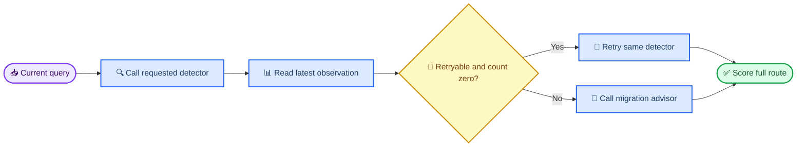

# 多步工具路由 GRPO 价值评测 V5

_Qwen3.5-35B-A3B 与 Qwen3.5-4B · sealed qualification · 2026-07-15_

---

## 📋 结论

- 最终 sealed 集包含 `240` 条 case、`30` 个实体块和 `480` 个决策，35B strict 为 `238/240`（`99.17%`），4B strict 为 `158/240`（`65.83%`），差值 `33.33` 个百分点
- 只比较 `decision_type/action` 序列时，35B 为 `240/240`（`100%`），4B 为 `176/240`（`73.33%`），差值 `26.67` 个百分点
- 数据集不能靠恒定动作取巧：每个题族固定为 `60%` 迁移、`40%` 原检测器重试；always-migrate 与 always-retry 的上限分别为 `60%` 和 `40%`
- 预注册确认门禁共 `13` 项，其中 `12` 项通过；唯一未通过项是 4B strict 失败中的 argument-only 比例为 `21.95%`，高于上限 `20%`
- 建议将本版本标记为 `route-qualified`，用于观察路由训练进展；不要将其标记为 `strict-gate-passed`，也不要在完成 `3x` 稳定性评测前升级为正式回归集
- 本研究没有启动训练；当前结果只确定了可训练的目标能力，不证明 GRPO 相对 SFT 的因果收益

## 🎯 评测目标与结构

评测只聚焦一个清晰的多步软边界：第一步必须调用指定视觉检测器；第二步必须读取当前 query 最新 observation，在“仍有一次重试预算”和“不可重试或预算已耗尽”之间选择原检测器或迁移顾问。同一题族的两类 case 使用相同 `gateway_error` 别名，动作差异只由 `retryable/retry_count` 决定。

### 数据隔离

| 检查 | 结果 |
| --- | ---: |
| Confirmation cases | 240 |
| Entity clusters | 30 |
| Calibration/confirmation case ID overlap | 0 |
| Entity ID overlap | 0 |
| Template ID overlap | 0 |
| Normalized query overlap | 0 |
| Fixture family overlap | 0 |
| 既有 case 文件扫描数 | 27 |
| 与既有 case/query 重叠 | 0 |

Confirmation 在 calibration 题族冻结后才生成，并更换实体、题面风格、错误别名与 fixture family。Confirmation 文件哈希为 `ce93598667167c2ae3d0cdf69e303fec0652e5719923728cd8eb806d1eaa17e3`。

## 📊 结果

### 迭代与校准

| 版本 | Cases | 35B strict | 4B strict | Gap | 处置 |
| --- | ---: | ---: | ---: | ---: | --- |
| V3 connected run | 384 | 65.10% | 67.19% | -2.08 pp | 作废，有未恢复截断；数值仅作诊断 |
| V4 calibration | 240 | 98.75% | 88.33% | 10.42 pp | 拒绝，4B 已饱和 |
| V5 calibration, 384-token run | 240 | 不报告 | 58.33% | 不报告 | 作废，35B 有未恢复截断 |
| V5 calibration, 1024-token replacement | 240 | 98.33% | 58.33% | 40.00 pp | 通过，冻结 8 个完整题族 |
| V5 sealed confirmation | 240 | 99.17% | 65.83% | 33.33 pp | 路由合格，strict 门禁 12/13 |

V3 的首次 35B 请求暴露过 SOCKS 依赖环境错误；该运行整轮排除。随后由 `.venv` 发起的 connected run 仍有 `2` 次修复轮截断，因此也不具备正式校准资格。V5 的 384-token 35B 轮次有 `28` 次首轮截断和 `2` 次修复轮截断，同样整轮排除。最终 V5 calibration 与 confirmation 的两模型均为 `0` 空决策、`0` API/rollout error 和 `0` completion truncation。

### Sealed confirmation 主指标

| 指标 | 35B | 4B | 35B - 4B |
| --- | ---: | ---: | ---: |
| Strict full trajectory | 99.17% | 65.83% | 33.33 pp |
| Exact action route | 100.00% | 73.33% | 26.67 pp |
| Mean reward | 0.999879 | 0.884058 | 0.115821 |

以 `entity_id` 为 cluster 做 `20,000` 次 paired bootstrap，strict gap 的 `95% CI` 为 `[20.42, 47.08]` 个百分点。35B strict 的 cluster-bootstrap `95% CI` 为 `[97.92%, 100%]`，4B 为 `[52.08%, 78.75%]`。

### 按目标动作分解

| 目标动作 | Cases | 35B strict | 35B route | 4B strict | 4B route |
| --- | ---: | ---: | ---: | ---: | ---: |
| Migration advisor | 144 | 98.61% | 100.00% | 50.00% | 55.56% |
| Retry same detector | 96 | 100.00% | 100.00% | 89.58% | 100.00% |

4B 的主要缺口不是“不会调用检测器”，而是在不可重试或预算耗尽时仍重复检测。重试 anchor 保持 `96/96` route 正确，避免将“所有第二步都迁移”误当作进步。

### 按检测器与题族分解

| Family | 35B strict | 4B strict | 4B route |
| --- | ---: | ---: | ---: |
| `qwen_timeout_nonretryable` | 100.00% | 53.33% | 60.00% |
| `rex_timeout_nonretryable` | 100.00% | 80.00% | 90.00% |
| `qwen_timeout_budget_exhausted` | 96.67% | 50.00% | 56.67% |
| `rex_timeout_budget_exhausted` | 96.67% | 80.00% | 90.00% |
| `qwen_connection_nonretryable` | 100.00% | 56.67% | 60.00% |
| `rex_connection_nonretryable` | 100.00% | 73.33% | 83.33% |
| `qwen_connection_budget_exhausted` | 100.00% | 60.00% | 63.33% |
| `rex_connection_budget_exhausted` | 100.00% | 73.33% | 83.33% |

按 detector 汇总，35B strict 在 Qwen/Rex 上均为 `119/120`；4B 分别为 `66/120` 与 `92/120`。这表明 Qwen 分支的训练空间更大，但 Rex 分支仍保留 `23.33` 个百分点以上的 strict headroom。

## 🔍 门禁解释

Confirmation gate 的结果文件保持 `status=fail`，原因仅为 `base_argument_only_share_at_most_0_20=false`：

| 4B strict 失败分解 | Cases | 占 strict 失败 |
| --- | ---: | ---: |
| Route failure | 64 | 78.05% |
| Argument-only failure | 18 | 21.95% |
| Strict failures total | 82 | 100.00% |

路由失败仍占主导，并超过预注册的 `70%` 下限；但 argument-only 比例高出 `20%` 上限 `1.95` 个百分点，因此不能事后将全量门禁改写为通过。4B 的 argument-only 错误主要是检测 `label` 使用项目名而非目标名；35B 的两个 strict 失败则是迁移 `user_query` 在编号与“号”之间插入空格，动作和语义均正确。

建议保留两套不冲突的使用口径：

- `route-qualified`：用于判断 GRPO 是否学会 observation-conditioned 路由，主指标为 exact action route
- `strict-diagnostic`：同时观察动作参数，不宣称当前版本通过全部 strict 门禁

不要删除 18 个 argument-only case，也不要修改 sealed gold 来追求门禁通过。

## ✅ 对 GRPO 的适用性

该集合比 245 回归集更适合体现这次 GRPO 的局部价值，原因是：

- 优化目标位于明确的 `grpo_target_step=2`，不是首步关键词路由
- 每个题族同时包含正反状态，且同一错误别名下只改变 `retryable/retry_count`
- 35B 在未见实体与错误别名上达到 `100%` route，为目标策略提供可靠上界
- 4B route 为 `73.33%`，既有明显 headroom，又不是完全无正样本支持
- 失败以 wrong route 为主，可用 exact action、参数、forbidden action 和 finish flag 组合成可验证 reward

它仍不能单独证明“GRPO 有效”。训练阶段必须比较同一 SFT 初始化上的 `SFT-only` 与 `SFT+GRPO`，保持训练数据、步数、seed 与推理配置一致；否则只能说明模型间存在能力差，而不能归因给 GRPO。

## ⚠️ 限制与下一步

- 当前是 `1x` qualification，不是正式 `3x` 稳定性回归；升级前需补齐三次全量 confirmation
- 范围只覆盖技术错误下的 retry/migrate 软边界，不代表全部复杂意图或三步以上状态机
- Calibration 与 confirmation 都是合成策略合同；后续应补少量真实业务日志派生但去重后的同构 case
- 训练数据必须与 calibration、confirmation 的 case/entity/query/error-alias 全部隔离
- GRPO 前先在训练候选集上做多采样支持审计；若某题族无正向 rollout，再使用独立 SFT warm-up，不得用 sealed case 热身

推荐执行顺序：

1. 构建与 V5 同规则、不同实体/别名/题面的训练池
2. 对 4B 在 target step 2 做 stochastic support audit
3. 固定一个 SFT initializer，训练 `SFT-only` 与 `SFT+GRPO` 两个分支
4. 先跑 sealed V5 route/strict 双指标，再跑 245 回归集检查能力回退
5. 候选模型通过后补 V5 `3x`，再决定是否升级为正式回归集

## 🔗 关键产物

- [V5 预注册](./preregistration_v5.json)
- [V5 运行修复记录](./v5_runtime_remediation.json)
- [Calibration 构建报告](../../../data/datasets/planner_multistep_grpo_value_v5/build_report_calibration.json)
- [Confirmation 构建报告](../../../data/datasets/planner_multistep_grpo_value_v5/build_report_confirmation.json)
- [Calibration whole-family gate](../../../data/datasets/planner_multistep_grpo_value_v5/calibration_family_gate_t1024.json)
- [Confirmation gate](../../../data/datasets/planner_multistep_grpo_value_v5/confirmation_gate.json)
- [Cluster bootstrap](../../../data/datasets/planner_multistep_grpo_value_v5/confirmation_cluster_bootstrap.json)
- [Sealed confirmation cases](../../../training/planner_grpo_seed_v1/cases/planner_multistep_grpo_value_v5_confirmation_cases.jsonl)
- [35B aggregate](/raid/zkq/artifacts/CAPA/evals/20260715_planner_multistep_grpo_value_v5/confirmation/qwen35_a3b_combined/qwen35_a3b_v5_confirmation_t1024_aggregate.json)
- [4B aggregate](/raid/zkq/artifacts/CAPA/evals/20260715_planner_multistep_grpo_value_v5/confirmation/qwen35_4b_combined/qwen35_4b_v5_confirmation_t1024_aggregate.json)

_Training status: not started._
