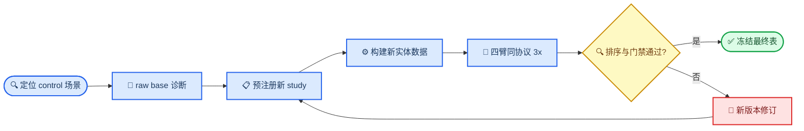

# Qwen3.5 4B→35B 能力阶梯实验跟踪

_CAPA Planner · 最终更新：2026-07-20 UTC · 状态：`PRIMARY_LADDER_CONFIRMED / AUXILIARY_35B_RANGE_GATE_FAILED`_

---

## 📋 结论摘要

V15 全新实体/词表、同集四臂、三次完整运行已经得到目标表：

`4B Base 14.80 < 4B SFT 74.69 < 35B 92.24 < 4B GRPO 100.00`

35B 三轮为 `87.93 / 95.33 / 93.47`，均超过 85%；GRPO 三轮均为 100%。完整场景、血缘、失败实验、哈希与复查命令统一收录在 [FINAL_V15_HANDOFF.md](FINAL_V15_HANDOFF.md)。

额外预注册的 `35B range<=5pp` 保守门没有通过（实际 `7.4pp`），所以原始机器报告仍标记 `fail`；用户要求的排序、Base 下限、35B 每轮下限与 GRPO 超越均已通过。

## 2026-07-17 历史审计（以下保留作探索背景）

## 🎯 当前目标与验收合同

旧的 V8–V12 合同刻意寻找“4B-GRPO 超过 35B”的 residual，因此选择了 35B 很弱的 primary 场景。当前目标已经改变为“35B 稳定居首、4B 后训练逐级改善”，必须建立新的 study contract，不能沿用旧 primary 的胜负定义。

| 合同项 | 新 study 的冻结规则 | 当前状态 |
| --- | --- | --- |
| 四臂身份 | raw 4B、固定 SFT、从该血缘继续的 GRPO、固定 35B | 资产已定位 |
| 同集比较 | 四臂使用同一 case 文件、prompt、parser、verifier 和步数上限 | 尚未完成 |
| 主指标 | `strict complete-trajectory pass rate` | 已有 verifier |
| 排序 | `base < SFT < GRPO < 35B` | 尚未完成 |
| 两端阈值 | base 目标约 `<65%`；35B 目标约 `>85%` | 局部证据满足 |
| 稳定性 | 每臂 deterministic 3x；35B 每轮均应高于下限 | V2 满足，V12 未做 |
| 统计单位 | `entity_id` 配对；报告 entity-clustered bootstrap CI | 已有实现 |
| 安全门 | JSON/coverage 完整，零最终 runtime error，错误副作用不恶化 | V12 sealed 未通过 |
| 防污染 | 新实体、题面、alias、fixture；confirmation 不参与选择 | 需要新建 |

正式声明分两级：点估计严格单调只能称为“描述性阶梯”；相邻差值的 entity-paired 95% CI 下界均大于零，且 3x 无反向，才称为“稳定阶梯”。阈值本身可按用户要求微调，但同集、同指标和无事后筛选不可放宽。

### 待填写的最终交付表

只有新 confirmation 完成后才填写“结果”和“置信区间”列。

| 模型 | 冻结资产 | Strict 3/3 pass-all | Entity 95% CI | 状态 |
| --- | --- | ---: | ---: | --- |
| Qwen3.5-4B-base | `/raid/zkq/models/Qwen3.5-4B` | 待运行 | 待运行 | 未完成 |
| Qwen3.5-4B-SFT | V6 `checkpoint-100` | 待运行 | 待运行 | 未完成 |
| Qwen3.5-4B-GRPO | V10 ckpt10 → V12 ckpt5 | 待运行 | 待运行 | 未完成 |
| Qwen3.5-35B-A3B | 固定 gateway model ID | 待运行 | 待运行 | 未完成 |

## 📊 最接近目标的现有结果

### V12 sealed controls：最强三臂候选

V12 的六类 control 在 sealed 之前就被定义为 control，但把它们用于当前新目标仍属于结果后的场景发现。以下表格是候选证据，不是最终四臂结论。

| 模型 | 正确/总数 | 通过率 | 与前一臂差值 | 有效性 |
| --- | ---: | ---: | ---: | --- |
| 4B-base | 未运行 | — | — | 缺失 |
| 4B-SFT | 165/288 | 57.29% | — | 单次 sealed |
| 4B-GRPO | 209/288 | 72.57% | +15.28pp | 单次 sealed |
| 35B-A3B | 286/288 | 99.31% | +26.74pp | 单次；非 3x |

三臂的 wrong-side-effect count 均为 `0`。V12 全体 432 cases 的 overall 也保持 SFT `46.99%` < GRPO `58.56%` < 35B `67.59%`，但 35B 低于目标下限，因此不能使用 overall 作为目标场景。

### Control 子场景排序

| 子场景，48 cases/项 | 4B-SFT | 4B-GRPO | 35B-A3B | 处置 |
| --- | ---: | ---: | ---: | --- |
| `missing_required_state_step2` | 52.08% | 89.58% | 100.00% | 首选单场景候选 |
| `post_retry_metric_veto_step3` | 52.08% | 66.67% | 97.92% | 次选，梯度更平滑 |
| `nonretryable_step2` | 68.75% | 93.75% | 100.00% | SFT 略高，适合作组合项 |
| `budget_exhausted_step2` | 81.25% | 91.67% | 100.00% | base 可能过高，作稳定项 |
| `conflicting_state_step2` | 89.58% | 91.67% | 97.92% | headroom 太小，作 guardrail |
| `post_retry_error_step3` | 0.00% | 2.08% | 100.00% | 4B 两臂过低，不单独使用 |

V6 的开发集在同类 `missing_required_state` 机制上记录过 base action `50%`、SFT action `60%`。这支持“raw base 可能低于 V12 SFT”的假设，但 V6 是 action accuracy，V12 是 strict complete trajectory，且实体不同；该数字不得填入上面的空白 base 单元格。

### 明确排除的 V12 primary

V12 primary residual 为 SFT `26.39%`、GRPO `30.56%`、35B `4.17%`。它实现了旧研究问题中的 `GRPO > SFT > 35B`，但与当前要求的 35B 稳定居首完全相反；三个 primary 场景不得进入新的 capability-ladder confirmation。

## 🔍 有价值实验日志

### 场景发现与端点分离

| 版本 | 数据与协议 | 核心结果 | 价值 | 最终处置 |
| --- | --- | --- | --- | --- |
| V2，2026-07-14 | 600 cases、75 entities、3x | 4B `63.33%`；35B 3/3 pass-all `97.17%` | 唯一同时证明 base 下限与 35B 稳定性的同集证据 | 保留为端点筛选；缺 SFT/GRPO |
| V5，2026-07-15 | 240 cases、30 entities、1x | 4B strict `65.83%`；35B `99.17%` | 定位 retry-vs-migrate 状态边界 | 仅复用机制；数据有 shortcut 且已参与开发 |
| V7 pilot，2026-07-16 | residual dev，216 cases | overall SFT `36.57%`、35B `64.35%`；controls SFT `54.17%`、35B `98.61%` | 首次显示 migration controls 才是 35B 强项 | 探索证据，不作 final |
| V12 controls，2026-07-17 | sealed，288 cases、24 entities、1x | SFT `57.29%` < GRPO `72.57%` < 35B `99.31%` | 当前最接近目标的三臂结果 | 用全新实体复制；禁止事后补臂冒充 sealed |

V2 的 4B 共有 220 个 strict failure，其中 185 个是 typed argument 的词面 alias 差异，忽略该 alias 后诊断通过率为 `94.17%`。因此 V2 的漂亮 gap 很可能被 SFT 一次性修满，不一定给 GRPO 留出足够 route headroom。

V5 的数据问题包括：`overall_badge` 可 100% 预测目标动作、每个 entity 只对应一种动作、retry 轨迹在第二次 detector 后截断、prompt 暴露 case ID/绝对路径/training thought，以及 retry canonical reward 只能到 `0.9167`。V5 不能承担最终确认。

### SFT 与 GRPO 训练主线

| 版本 | Optimizer | 关键结果 | 门禁结论 | 可复用经验 |
| --- | ---: | --- | --- | --- |
| V6 | SFT 100；GRPO 0 | dev action base `77.31%`→SFT `97.69%`；sealed full trajectory `90.89%` | GRPO 方差仅 `2/180=1.11%`，停止 | SFT 有效，但原 GRPO 池被修满 |
| V7 | 0 | primary support `76.39%`，方差 `24.31%` | gold support `<80%`，停止 | 不能只看 reward 方差 |
| V8 | 0 | gold support `93.06%`，方差 `1/72=1.39%` | 方差 `<15%`，停止 | 题面过直会让 policy 饱和 |
| V9 | GRPO 40 | primary SFT `23.61%`→ckpt40 `76.39%` | controls `38.89%`→`1.39%`，no promotion | 首次学到主任务，但灾难性遗忘 |
| V10 | GRPO 10 | primary `8.33%`→`16.67%`；controls `45.83%`→`65.28%` | wrong side effects `35→37`，no promotion | replay 修复遗忘，安全门仍必要 |
| V11 | 0 | task support/方差通过 | safety-variance `32<43`，停止 | support 分布必须匹配 optimizer |
| V12 | GRPO 8 | selection ckpt5：primary `19.44%`→`34.72%`，controls `43.75%`→`68.75%` | selection promote；sealed safety `78→88`，objective fail | 三臂 control ladder 成立，但安全未泛化 |

V12 的 GRPO arm 不是“从 SFT 直接训练 5 步”。真实血缘为：

`Qwen3.5-4B base → V6 SFT checkpoint-100 → V10 GRPO checkpoint-10 → V12 GRPO checkpoint-5`

| 资产 | 路径或 ID | 冻结标识 |
| --- | --- | --- |
| Raw 4B | `/raid/zkq/models/Qwen3.5-4B` | 新 study 需补模型清单 hash |
| V6 SFT | `experiments/runs/20260716_qwen35_4b_planner_v6_sft_seed42_v1/checkpoint-100` | adapter `0c09452034727fe41908fc37d35866b68c227c9e8c680e66fbf0a043ae8aca60` |
| V12 GRPO | `experiments/runs/20260717T045432Z_qwen35_4b_optimizer_matched_v12_screen8_seed42/checkpoint-5` | adapter `8d0112e0ce067ac479f7245c84be68b875e474dbb37b2df033f88d53e29c1ee3` |
| 35B reference | `Qwen3.5-35B-A3B` gateway | 冻结 endpoint/model ID |

## ⚠️ 不可使用或受限证据

| 记录 | 问题 | Canonical 处置 |
| --- | --- | --- |
| V3 connected run | 35B 有未恢复截断 | 数字仅作诊断，不进入比较 |
| V5 384-token calibration | 35B 有 28 次首轮及 2 次修复轮截断 | 使用 1024-token replacement 作为历史记录 |
| V5 confirmation | badge shortcut，且结果已指导后续开发 | 只复用规则，不复用 final rows |
| V9 首次 selection | 错误 cuDNN runtime 产生 fallback 输出 | 使用 CUDA 12.4 后的 `selection_decision.json` |
| V10 初版 support decision | 漏执行预注册 block checks | 使用修正后的 `support_decision.json` |
| V12 初始 larger outputs | gateway direct route/stream transport 失败 | 仅使用冻结的 runtime-clean replacement |
| V12 sealed rows | `single_use_sealed_test=true`，且已查看分层结果 | 不训练、不选 checkpoint、不作新四臂 claim |

V12 的 4B 本地推理上限为 320 tokens，而 35B 路径使用更大上限；larger 还有 6 个空响应按预先提交、correctness-blind 的规则各重试一次。新 study 必须让四臂采用相同、经 calibration 冻结且无 clipping 的 completion 上限。

此外，本任务评估的是 Planner 对结构化 observation 的策略决策，不是真实视觉模型质量：图片像素不发送给 Planner，工具 observation 为受控 fixture。最终结论必须限定为 CAPA Planner policy 场景。

## 🔄 下一轮执行顺序

现有 V12 controls 可以先补 raw 4B 做低成本诊断，但该运行必须标为 `post_hoc_diagnostic_only`。无论诊断是否形成漂亮排序，正式表都必须在新实体 confirmation 上重跑四臂。



### 最小下一步

1. 在完整 V12 control slice 上补 raw 4B，仅判断 candidate family 是否值得复制；不得只挑看起来最好的 case
2. 建立全新 entity-disjoint calibration/confirmation，优先覆盖 `missing_required_state_step2` 与 `post_retry_metric_veto_step3`，并保留其它 migration controls 作为 guardrail
3. 在 calibration 上冻结场景组合、共同 token 上限、相邻差值规则和四臂精确 hash；之后不再看 confirmation
4. 同时运行 raw 4B、V6 SFT、完整血缘的 V12 GRPO、35B，四臂 deterministic 3x
5. 报告 strict pass-all、每轮结果、entity-paired CI、JSON/coverage/runtime、wrong-side-effect 和逐场景诊断
6. 只有全部门禁通过，才替换本文件中的“待填写最终交付表”

如需声明“GRPO 方法稳定”而不仅是“这个 checkpoint 稳定”，还应使用同一冻结 checkpoint step 补 seed43/44；不能把同一 seed 的 3 次 deterministic inference 当作训练复现。

## ⚙️ 可复用实现入口

| 环节 | 入口 | 用途 |
| --- | --- | --- |
| 场景定义 | `training/planner_grpo_seed_v1/scripts/build_planner_retry_safe_end_hard_residual_v9.py` | 九类状态合同的来源 |
| V12 数据构造 | `training/planner_grpo_seed_v1/scripts/build_planner_retry_optimizer_matched_v12.py` | 复用生成结构，不复用实体/rows |
| Rollout | `training/planner_grpo_seed_v1/scripts/run_planner_grpo_rollout.py` | 统一本地 Planner 运行 |
| Repeated eval | `training/planner_grpo_seed_v1/scripts/run_repeated_planner_grpo_eval.py` | 四臂 3x 评测 |
| Verifier | `training/planner_grpo_seed_v1/scripts/reward_planner_grpo.py` | strict full-trajectory 判定 |
| Paired compare | `training/planner_grpo_seed_v1/scripts/compare_planner_rollout_models.py` | entity-clustered 比较 |
| V12 selection | `scripts/run_qwen35_4b_v12_selection_eval.sh` | adapter 评测参考实现 |
| 35B gateway | `scripts/run_qwen35_v9_larger_reference_eval.sh` | larger reference 入口 |

新评测脚本还需要补一项：V12 sealed runner 只覆盖 SFT/GRPO/35B，新的 runner 必须显式加入 raw base，并强制四臂共享 generation contract。

## 📚 事实源与审查入口

### 核心结果

- [V2 4B/35B 评测报告](../../../reports/QWEN35_4B_MULTISTEP_V2_EVAL_AND_GRPO_COMPAT_20260714.md)
- [V2 结构化结果](../planner_multistep_tool_routing_grpo_qwen25_7b_v1/qwen35_4b_evaluation_result_20260714.json)
- [V5 场景差分报告](../planner_multistep_tool_routing_grpo_qwen35_4b_v1/GRPO_VALUE_EVAL_V5_20260715.md)
- [V5 数据与 reward 审计](../../../reports/QWEN35_4B_V5_TRAIN_V1_DATA_AUDIT_20260715.md)
- [V6 SFT 最终结果](../planner_retry_migrate_v6_qwen35_4b_v1/final_result.json)
- [V9 selection 决策](../planner_retry_safe_end_hard_residual_v9_qwen35_4b_v1/selection_decision.json)
- [V10 selection 结论](../planner_retry_anti_forgetting_v10_qwen35_4b_v1/SELECTION_RESULT.md)
- [V11 support 门禁](../planner_retry_safety_balanced_v11_qwen35_4b_v1/SUPPORT_GATE_RESULT.md)
- [V12 support 结果](../planner_retry_optimizer_matched_v12_qwen35_4b_v1/SUPPORT_GATE_RESULT.md)
- [V12 selection 结果](../planner_retry_optimizer_matched_v12_qwen35_4b_v1/SELECTION_RESULT.md)
- [V12 sealed 结论](../planner_retry_optimizer_matched_v12_qwen35_4b_v1/SEALED_RESULT.md)
- [V12 sealed 结构化指标](../planner_retry_optimizer_matched_v12_qwen35_4b_v1/sealed_objective.json)
- [后训练完整手册](../../../reports/POST_TRAINING_SFT_GRPO_PLAYBOOK.md)

### Artifact integrity

| 证据 | SHA-256 |
| --- | --- |
| V2 4B aggregate | `376ed679db4548ace0d851257b19c6935e355af694a4e2290f3839582d8023a4` |
| V2 35B aggregate | `eda2a5c96d20d9671dc5dd7e9d65eb40c0efb070726382899d87a883d0895f98` |
| V5 35B aggregate | `459697f8e43c2979f76b6c28fe9e0f29298a91fca5ce614d780c19221074c5fd` |
| V5 4B aggregate | `9c7e2457ba06b5eaff59a94243c287dac2b9f7047aeac6e8be022c1eb3d1fc05` |
| V6 final result | `b56185d3a5204356b299054cdc2c625c9ab4cdbc6a20149831cb41e00a31bfbb` |
| V9 selection decision | `2353973e4460bced5d9b901cd1030f620308df3ed26a6a15cd98d2354b35980a` |
| V10 selection decision | `b5ea4b9b06a1e7bcc7738aa69b822bf8042ba70e4f6ab4b21c04fbb512d75f95` |
| V12 sealed objective | `89b05e9706e0e8c68ff17395b48bcbb9ea351319203886115326328fc8ac000d` |

## 🗂️ 仓库状态与维护规则

审计开始时：`main` 相对 `origin/main` ahead 47、behind 0；tracked/staged diff 为空；有 7,174 个未跟踪文件，约 68 MiB，主要是 V9–V12 rollout 和 checkpoint 运行树。不要清理或覆盖这些文件；后续先按 run manifest/hash 判断是否已经有结果。

[全局 registry](../../registry.jsonl)、[CURRENT](../../../reports/CURRENT.md)、[leaderboard](../../../reports/leaderboard.csv) 和 `experiments/project_status.json` 仍停留在 2026-07-13 的 Qwen2.5 研究线，尚未登记 V5–V12。本文件在 capability-ladder study 完成 registry 回填前，是该新目标的人工审查入口；生成页不得作为最新 Qwen3.5 事实源。

每次后续工作必须在本节末尾追加一条日志，并更新顶部状态：

```text
YYYY-MM-DD HH:MM UTC | study/run ID | hypothesis | dataset+model hashes |
protocol | result | gate decision | canonical artifact | next allowed action
```

### 追加日志

| 时间 | 工作 | 结果 | 决策 | 下一步 |
| --- | --- | --- | --- | --- |
| 2026-07-17 08:04 UTC | V2/V5/V6–V12 只读审计 | 目标未完成；V12 controls 定位为首选候选 | 建立新的 capability-ladder contract | raw-base 诊断，然后新实体四臂预注册 |
