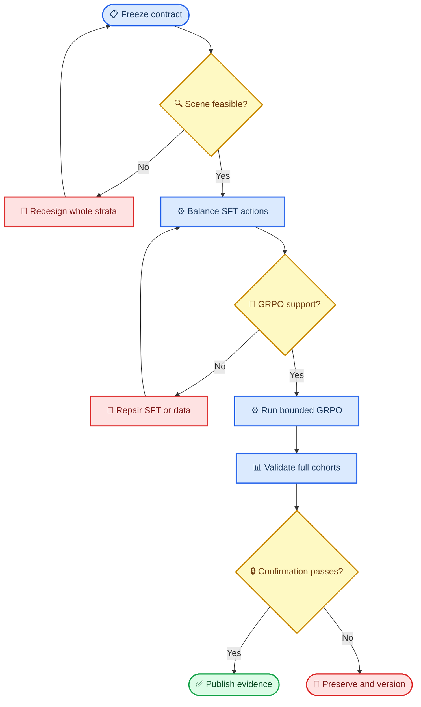

# CAPA SFT → GRPO 后训练实战手册

_阅读时间约 45 分钟 · 难度：进阶 · 最后验证：2026-07-20 UTC · 案例范围：Qwen3.5-4B / 35B-A3B，V6–V15，68-node 探索树_

---

## 📋 你会学会什么

这份手册不是“把训练命令跑通”，而是用本项目完整的成功与失败记录，教你建立一条可以相信的后训练证据链：先证明场景在数学上可行，再用 SFT 安装正确动作支持，用 GRPO 微调仍有随机余量的决策边界，最后通过一次性、实体与词表隔离的 confirmation 证明结果没有靠开发集措辞或事后筛选获得。

完成整套流程后，你应该能回答这些问题：

- 为什么训练前必须先证明 `base < 65%` 与 `35B > 85%` 可以在同一完整场景成立
- SFT 应该教什么、为什么动作类别平衡比简单增加样本更重要
- GRPO batch 是否真的有组内 reward 方差、正确动作支持和非零更新
- 为什么“loss 很低”“reward 上升”“训练健康”都不等于模型可发布
- 如何区分 inference 重复稳定性、训练 seed 稳定性与跨词表泛化
- 如何保存失败 confirmation，使它成为下一版本的开发证据而不是被悄悄删除

最终案例结果如下。分数是预注册的 strict complete-trajectory 加权通过率，不是通用能力分数：

| 模型 | Run 1 | Run 2 | Run 3 | 均值 | 极差 |
| --- | ---: | ---: | ---: | ---: | ---: |
| Qwen3.5-4B Base | 14.80% | 14.80% | 14.80% | **14.80%** | 0.00pp |
| Qwen3.5-4B original SFT | 75.00% | 67.60% | 81.47% | **74.69%** | 13.87pp |
| Qwen3.5-35B-A3B | 87.93% | 95.33% | 93.47% | **92.24%** | 7.40pp |
| Qwen3.5-4B targeted-SFT + one-step GRPO | 100.00% | 100.00% | 100.00% | **100.00%** | 0.00pp |

严格均值顺序为 `Base < original SFT < 35B < targeted-SFT+GRPO`。Base 低于 65%，35B 每轮高于 85%，GRPO 比 35B 高 `7.7556pp`。完整证据见 [V15 最终交接](../experiments/studies/planner_qwen35_4b_capability_ladder_v1/FINAL_V15_HANDOFF.md)。

> ⚠️ **血缘限定：**表中的 original SFT 是 V6 `checkpoint-100`；最终 GRPO 臂是另一条 targeted-SFT warm-start 后再做一步 GRPO 的血缘。不能把结果写成“original SFT 直接做一步 GRPO 后达到 100%”。

> 📌 **门禁限定：**V15机器报告总状态仍为 `fail`，唯一原因是额外预注册的35B三轮极差 `<=5pp` 未通过，实际为 `7.4pp`。用户要求的35B每轮 `>85%` 与全部阶梯门通过；核心目标与辅助门必须分开陈述。



## 🧠 核心心智模型

### SFT 安装支持，GRPO移动边界

本案例最终成功不是因为“GRPO比SFT高级”，而是因为两者承担了不同任务：

| 阶段 | 最适合解决的问题 | 不应指望它解决的问题 |
| --- | --- | --- |
| SFT | JSON格式、动作词、参数复制、离散状态规则、缺失动作类别 | 在已经饱和的同分布样本上继续创造GRPO方差 |
| GRPO | 已有正确动作支持时，利用组内相对reward微调窄决策边界 | 从几乎采不到正确动作的策略中凭空发现规则 |
| Confirmation | 检查跨实体、跨词表和完整协议的泛化 | 继续选场景、调权重、换checkpoint |

本项目的转折点是 n52：deep SFT 在 V13 上出现 `metric-veto 12/12`、`current-success 0/12` 的条件坍缩。继续升温只得到无效JSON和长输出。直到 n58 把 `retry / migrate / end` 三个目标动作机械地平衡为 `24 / 24 / 24`，最早的 checkpoint-6 才同时在两个分支达到 `12/12 + 12/12`，并仍保留可供 GRPO 使用的随机方差。

### GRPO学习信号来自组内比较

本项目使用 group-scaled GRPO。对同一个 prompt 的一组 reward `r₁…r_G`，有效信号来自组内相对差异，可简化理解为：

```text
A_i ≈ (r_i - mean(r_group)) / std(r_group)
```

当 `std(r_group)=0` 时，这一组没有相对偏好信号。成功的 n64 一步更新中，`reward_std=0.196158`、`advantage_std=0.432900`、`advantage/abs_mean=0.386152`；原始 advantage 均值接近零是组归一化的预期结果，不是“没有学到”。真正危险的是 `reward_std=0`、`advantage/std=0`、`grad_norm=0` 与 adapter hash 不变同时出现。

### 优化目标不是最高单次分数，而是最大最弱余量

能力阶梯应关注最薄弱的约束。可以把开发目标写成：

```text
margin = min(
  SFT - Base,
  Larger - SFT,
  GRPO - Larger,
  65 - Base,
  min(Larger_run) - 85
)
```

选择时最大化 `margin`，而不是只最大化 GRPO 分数。这样能阻止“主任务涨很多但 control 崩掉”或“35B均值很高但某一轮跌破门槛”的候选被错误晋级。n63 也说明，同分时应优先更早、更稳定的 checkpoint：checkpoint-12 的均值高于 checkpoint-6，但波动更大；最终从 checkpoint-6 继续训练更可靠。

## 🎯 实验合同与数据隔离

### 先冻结“超过”的含义

模型比较必须在训练前固定，否则训练后总能找到一个好看的切片。

| 合同项 | CAPA 当前约定 |
| --- | --- |
| 目标模型 | raw `Qwen3.5-4B` |
| 比较用 SFT 臂 | V6 original SFT `checkpoint-100`，冻结后不再训练 |
| 最终 GRPO 血缘 | n57 checkpoint-40 → n58 three-action SFT checkpoint-6 → n64 一步 GRPO |
| 正式大模型 reference | 固定 gateway model ID `Qwen3.5-35B-A3B` |
| 独立重复单位 | `entity_id`，不是同一 prompt 的多次 generation |
| 主指标 | 两类 Planner 场景的 strict complete-trajectory 加权通过率 |
| 主要门槛 | `Base<65%`；`Base<SFT<35B<GRPO`；35B 每轮 `>85%` |
| 辅助门槛 | 完整覆盖、零最终 runtime error、无选择性重跑；35B range `<=5pp` 单独披露 |
| 推理协议 | 同一 case、prompt、parser、verifier、步数和 token 上限；`temperature=0` |
| 图片协议 | 路径保留在上下文，像素不发送给 Planner；视觉由 detector 负责 |
| 最终声明 | 只声明在一次性封存的 CAPA V15 Planner 场景上达到该阶梯 |

> 📌 **关键区别：**“4B 比 35B 更好”是泛化过度；“targeted-SFT+GRPO 的 4B 在冻结的 V15 Planner routing 场景上高于固定 35B reference”才是证据支持的范围。

### 正确设计数据隔离

每个 split 必须使用不同实体、项目名、目标物、fixture、错误别名和格式化 prompt hash。推荐至少保留以下四层：

| Split | 用途 | 能否更新权重 | 能否选 checkpoint |
| --- | --- | :---: | :---: |
| `sft_train` | 安装格式、规则与动作支持 | 是 | 否 |
| `grpo_train` | GRPO optimizer 数据 | 是 | 否 |
| `support_dev_a/b` | 两个独立多采样 reward 支持块 | 否 | 否 |
| `selection_dev` | SFT/GRPO checkpoint 选择 | 否 | 是 |
| `opened_failed_confirmation` | 失败后只作为下一版本开发证据 | 否 | 是，但必须换新 confirmation |
| `sealed_confirmation` | 最终一次确认和大模型比较 | 否 | 否 |

实验单位是实体。一个实体下的 Qwen/Rex、不同状态反事实和四次 stochastic generation 都是相关测量，不能把它们当成独立样本。query style、badge、fixture、detector、error alias 应在实体块内完整或平衡交叉；生成顺序使用固定 seed 随机化。

V15 把这一原则实现为 `6 entities × 2 scenarios × 2 detectors = 24 cases`，并让 badge 与 fixture 形成完整平衡。新实体名、新 error alias、新 fixture 名和 case ID 在推理前生成并冻结；20 个保护词扫描 558 个历史与训练文件后精确重合为零。这里的核心不是“永远用24条”，而是让最小样本仍保持完整 factorial，避免某一模型只在被过度代表的词面上占便宜。

失败 confirmation 不能删除，也不能在原文件上重跑。V14 的 288 条预测全部保留，随后才被重新标记为 opened development evidence；V15 使用了新的实体、词表、图片 fixture、case ID、manifest 和 opening receipt。这样“从失败中学习”与“重复打开同一 test 调参”之间有清楚边界。

每次 build 后至少检查：

```bash
# 数据、实体、prompt 和 sealed commitment 审计
.venv-train/bin/python \
  training/planner_grpo_seed_v1/scripts/build_planner_retry_safe_end_hard_residual_v9.py

git diff --check
```

## ⚙️ 训练与选择工作流

### 阶段一：用 SFT 建立正确动作支持

SFT 负责教会模型格式、动作名、参数复制、停止条件和基本状态机。GRPO 不适合从“正确动作几乎采不到”的状态开始，因为同一组 generation 中没有正向样本可比较。

CAPA 已完成的 V6 证据是：同一实体隔离 SFT-dev 上，base action accuracy 为 `77.31%`，checkpoint-100 为 `97.69%`，提升 `20.38` 个百分点。这个结果证明 SFT 阶段有效，也固定了后续 GRPO initializer。

SFT 的正确检查顺序：

1. 在训练前冻结 train/dev、tokenizer、chat template 与 checkpoint 选择指标
2. 训练时记录 loss、token accuracy、learning rate、gradient norm 和非有限值
3. 在同一 dev 上比较 base、候选 checkpoint，不比较 test
4. 按预注册主指标选择一次 checkpoint
5. 保存 adapter、数据和配置 SHA-256

> ⚠️ **常见错误：**训练 loss 降到接近零不等于策略变好。必须用 held-out entity 的动作、参数和完整轨迹指标确认。

#### 从条件坍缩到三动作均衡

n48–n58 给出了比“多训几个epoch”更有价值的一组对照：

| 节点 | 训练干预 | Held-out 结果 | 诊断 |
| --- | --- | --- | --- |
| n48 | 24条 metric-only SFT，18步 | token accuracy `91%`，未授权评测 | JSON共享token掩盖了动作token错误 |
| n50 | 再做60步 deep SFT | 同任务reward全相同、梯度0、adapter不变 | 策略饱和，GRPO数学上无信号 |
| n52 | deep SFT确定性诊断 | metric `12/12`，current `0/12` | 单分支条件坍缩 |
| n53 | `migrate/end` 两动作平衡 | metric `9/12`，current `10/12` | 坍缩缓解，但缺少retry类别 |
| n57 | 更长两动作SFT | 最佳 `10/12 + 12/12` | 增加步数没有补上缺失动作类 |
| n58 | `retry/migrate/end=24/24/24` | cp6/12/18全部 `12/12 + 12/12` | 动作类覆盖解决规则归纳 |

n58 的可复用配方不是普适超参数，而是一个诊断范例：

| 参数 | n58 实际值 | 为什么重要 |
| --- | ---: | --- |
| 训练行数 | 72 | 三个目标动作各24条 |
| Loss | completion-only | 不让4k-token上下文淹没短动作目标 |
| LR / steps | `1e-5` / 18 | 一轮短训练，避免继续压低策略熵 |
| Global batch | 4 | 四卡，每卡1条，无梯度累积 |
| Max length | 4800 | 覆盖约4.2k–4.6k token长prompt |
| LoRA | `r=16, alpha=32, dropout=0` | 与既有Planner adapter一致 |
| Checkpoint规则 | 6、12、18；并列选最早 | 保留更多随机支持与跨措辞稳定性 |

训练集与 `dev` 在 n58 中是重复的，因此 `eval_loss=0.01097` 和 `eval token accuracy=0.9990` 只能证明训练健康，不能证明泛化。真正的选择证据来自未进入 optimizer 的完整 V13 style-2 cohort。下一次实验应把“loss-health dev”与“generalization dev”明确用不同字段命名，避免读者误把重复集当 held-out dev。

### 阶段二：挖掘适合 GRPO 的 residual

适合 GRPO 的场景要同时满足三个条件：SFT 仍有错误、正确动作能被随机采到、同一 prompt 的多个 completion reward 不完全相同。

对每个 prompt 采样 `G=4` 次，记 reward 为 `r₁…r₄`。若四个 reward 完全相同，组内标准差为零，归一化 advantage 也没有有效排序信号。此时硬跑 optimizer 只会制造“训练过”的假象。

CAPA 的两次失败很有教学价值：

| 版本 | 发现 | 正确动作 |
| --- | --- | --- |
| V6 | 只有 `2/180` 组有非零方差 | 不训练，重建 residual 数据 |
| V7 | 主 residual 方差率 `24.31%`，但 gold support 仅 `76.39%` | 不放宽 80% 门槛，不训练 |
| V8 | 选定场景 gold support `93.06%`，但方差仅 `1/72=1.39%` | 不训练；恢复困难措辞并新建 V9 |

V7 的 4B-SFT/35B exploratory pilot 冻结了三个场景：`current_success_step2`、`fresh_retry_step2`、`post_retry_success_step3`。它们同时满足两点：V7 随机采样仍有可用方差；35B 在完整轨迹上存在明显弱点。该 pilot 只能选场景，不能证明最终超过 35B；当时计划用新实体V9 sealed确认，但V9在selection阶段因control遗忘被拒绝，因此该sealed test从未物化。

V8 还揭示了另一个极端：把规则改写得过于直接后，模型几乎总是给出同一动作。正确率高不等于适合 GRPO；没有组内方差时 advantage 仍为零。V9 因此保留 V7 的自然故障/预算干扰措辞，并把 support 扩为两个独立的 12-entity block。

#### 先校准采样，不用 test 调参

V9 在生成新数据前，只用已经公开的 V7 最弱层 `post_retry_success × Rex` 比较温度 0.9 与 1.0。选择规则提前固定为：gold support ≥70%、方差率 ≥25% 的最低温度；两者都失败则回退 0.7。结果如下：

| 温度 | gold support | 非零方差率 | 结论 |
| ---: | ---: | ---: | --- |
| 0.9 | 83.33% | 25.00% | 通过并按最低温度规则选中 |
| 1.0 | 83.33% | 33.33% | 通过，但不选 |

这种校准可以决定训练采样分布，但不能进入最终效果证据链。对应的预注册、结果和文件哈希保存在 `experiments/studies/planner_retry_safe_end_hard_residual_v9_qwen35_4b_v1/`。

### 阶段三：在 optimizer 前执行硬门禁

支持度审计必须使用训练时相同的 temperature、top-p、completion 上限和 initializer，但使用独立 `support_dev`。建议门禁至少包括：

| 门禁 | 作用 |
| --- | --- |
| 样本与 prompt 组完整 | 排除掉卡、重复或漏样本 |
| JSON ≥99% | 确保 reward 不是格式噪声 |
| 截断 ≤1% | 避免把长度上限误当策略错误 |
| gold action support | 每组至少有机会采到正确动作 |
| 非零 reward 方差率 | 保证 GRPO 存在组内排序信号 |
| detector 分层最小组数 | 防止总体均值掩盖 Qwen/Rex 单侧失效 |

门禁失败时，optimizer steps 必须保持为零。允许的动作是新建版本、增加 SFT 或更换独立场景；不允许原地重采、删除不利样本或事后降低阈值。

#### Support必须是策略相关且trainer-faithful

“同一个模型、数据和temperature”仍不足以证明训练时会出现相同样本。n32 的独立 sampler 在 `T=1.7` 下通过 support，但 n33 真正 trainer 的第一步出现 `12/32=37.5%` completion clipping；根因是 sampler 重置了 prompt seed，而 trainer 使用 `torch.randperm(seed42)` 的行顺序和 rank 42–45 的持久 RNG stream。

后续 n35 先复现 n33 的 `32/32` token hash，才允许继续比较 `T=1.4/1.5`。下一次实验的 support replay 至少要冻结：

- initializer adapter SHA-256
- optimizer数据 SHA-256 与实际 row order
- world size、rank-to-prompt mapping 与每rank RNG stream
- `num_generations`、generation batch、gradient accumulation
- temperature、top-p、token上限、chat template 与 tokenizer IDs
- 与trainer完全相同的 stopping、invalid-value处理和解码路径

SFT之后也必须重做 support。n48 前的 `T=1.5` support 不能授权 n48 后的策略：SFT改变了entropy与输出长度，实际得到 `9/32=28.125%` clipping。Support是“checkpoint × data × sampler × RNG path”的联合性质，不是数据集自身的永久标签。

V9 最终得到 `576/576` 完整样本、`80.56%` gold support 和 `36.11%` 非零方差；六个场景×detector 层与 A/B 两个 block 全部通过。因此这是本项目第一个真正授权 optimizer step 的 residual 版本。

V9 的可执行顺序是：

```bash
# 1. 生成 train、两个 support block、selection，并只提交 sealed hash
.venv-train/bin/python \
  training/planner_grpo_seed_v1/scripts/build_planner_retry_safe_end_hard_residual_v9.py

# 2. 四卡 support sampling 完成后，合并并原子执行全部门禁
scripts/finalize_qwen35_4b_v9_support.sh

# 3. 只有 support_decision.json=pass 且 optimizer data 已冻结后才会启动
RUN_MODE=canary scripts/run_qwen35_4b_retry_safe_end_hard_v9_grpo.sh
RUN_MODE=screen scripts/run_qwen35_4b_retry_safe_end_hard_v9_grpo.sh
```

### 阶段四：先 canary，再做 GRPO screen

通过支持门禁后，先运行少量、预先固定的 optimizer step。canary 只回答“训练系统和梯度健康吗”，不回答“模型最终提升了吗”。V9 使用 5 步，V10 因为从同一 initializer 复现已验证的运行时，只使用 2 步。

CAPA 的 4 卡拓扑固定为：

| 参数 | 值 |
| --- | ---: |
| GPU ranks | 4 |
| 每卡 batch | 1 |
| `num_generations` | 4 |
| `generation_batch_size` | 4 |
| gradient accumulation | 8 |
| 每 optimizer step completion 数 | 32 |
| V9 learning rate | `5e-6` |
| V10 learning rate | `2e-6`，warmup 2 steps |

canary 的停止条件：任意非有限 loss/reward/gradient/parameter、trainable gradient 缺失、单卡峰值超过 28 GiB、空闲显存低于 2 GiB，或四类核心 W&B 遥测缺失。

canary 健康后才进入有上限的 screen，例如 10、40 或 100 steps，并在预先固定的 checkpoint 上做 `selection_dev` 评测。不要观察一条曲线后临时延长训练；最大 steps 和候选 checkpoint 必须在启动前写入 preregistration。

#### “训练健康”不等于“模型可发布”

V9 是这个区别最清楚的反例。它的 40-step screen 在运行层面全部通过：四卡梯度、显存、JSON、截断和 W&B 遥测都正常。但只有 7/40 个 step 有非零梯度；更重要的是，selection-dev 上 checkpoint-40 的 primary 完整轨迹率相对 SFT 提升 `52.78` 个百分点，同时 control 下降 `37.50` 个百分点。它学会了主场景，却灾难性遗忘了六个反事实 control，因此严格判为 `no_promotion`，V9 sealed test 从未物化。

V10 的修改不是继续加步数，而是把三类 primary 与六类 stability control 都放入 optimizer 数据，形成 `1:2` 的主任务/控制回放比例，并把 learning rate 降到 `2e-6`。两个独立 support block 上，primary gold support/方差率为 `79.86%/34.03%`，control 为 `78.13%/33.33%`；10-step screen 的每一步都有非零梯度。

V10 selection 证明 anti-forgetting 有效，但仍判为 `no_promotion`：checkpoint-10 的 primary 相对 SFT 提升 `8.33` 个百分点，control 提升 `19.44` 个百分点，primary entity-bootstrap 95% CI 为 `[+1.39pp, +15.28pp]`；然而错误副作用动作从 35 增至 37，违反“不得新增”门禁。这个结果说明 control pass rate 与逐动作安全约束不能互相替代。V10 sealed test 因此继续保持未物化。

#### V10 可复现命令链

下面的顺序体现了权限边界：support 通过前不能冻结 optimizer 数据，selection promote 前不能物化 sealed test。

```bash
# 1. 构建 train/support/selection；sealed 只写 commitment，不落盘 case
.venv-qwen35-grpo/bin/python \
  training/planner_grpo_seed_v1/scripts/build_planner_retry_anti_forgetting_v10.py

# 2. 两个 support block 各采 G=4，并原子执行所有门禁
scripts/run_qwen35_4b_v10_support.sh

# 3. 门禁通过后才从原始 train step-data 冻结 optimizer-only 数据
.venv-qwen35-grpo/bin/python \
  training/planner_grpo_seed_v1/scripts/freeze_planner_retry_anti_forgetting_v10_optimizer_data.py \
  --source training/planner_grpo_seed_v1/step_data/planner_retry_anti_forgetting_v10_grpo_train_qwen35_4b_nothinking_mixed_steps.jsonl \
  --support-decision experiments/studies/planner_retry_anti_forgetting_v10_qwen35_4b_v1/support_decision.json \
  --accepted-scenarios data/datasets/planner_retry_anti_forgetting_v10/accepted_optimizer_scenarios.txt \
  --output training/planner_grpo_seed_v1/step_data/planner_retry_anti_forgetting_v10_optimizer_qwen35_4b_nothinking_mixed_steps.jsonl \
  --manifest training/planner_grpo_seed_v1/step_data/planner_retry_anti_forgetting_v10_optimizer_qwen35_4b_nothinking_mixed_steps.manifest.json

# 4. canary 与正式 screen 都从同一个 SFT initializer 独立启动
RUN_MODE=canary scripts/run_qwen35_4b_retry_anti_forgetting_v10_grpo.sh
RUN_MODE=screen scripts/run_qwen35_4b_retry_anti_forgetting_v10_grpo.sh

# 5. screen 健康审计；RUN_DIR 替换为实际 screen 目录
.venv-qwen35-grpo/bin/python \
  training/planner_grpo_seed_v1/scripts/audit_qwen35_4b_grpo_screen.py \
  --run-dir "${RUN_DIR}" --expected-steps 10 --world-size 4 \
  --candidate-checkpoint 2 --candidate-checkpoint 5 --candidate-checkpoint 10 \
  --output experiments/studies/planner_retry_anti_forgetting_v10_qwen35_4b_v1/screen_health.json

# 6. 只在 selection-dev 比较 SFT 与三个 GRPO checkpoint
SCREEN_DIR="${RUN_DIR}" scripts/run_qwen35_4b_v10_selection_eval.sh

# 7. 以下两步只有 selection_decision.json=promote 时才被脚本授权
.venv-qwen35-grpo/bin/python \
  training/planner_grpo_seed_v1/scripts/prepare_planner_retry_anti_forgetting_v10_sealed_test.py \
  --screen-dir "${RUN_DIR}"
scripts/run_qwen35_v10_sealed_eval.sh
```

#### 从 V11 的失败学会“support 必须代表 optimizer”

V11 不是因为模型完全没有安全信号而失败。它的 1,728 个样本全部完整，JSON 为 100%，clipped 为 0，primary gold support/任务方差为 `81.25%/22.22%`，禁用动作样本率为 `8.22%`；三个 primary 场景各自的 safety-variance group 也都通过门槛。唯一失败项是总体 safety-variance group：`32 < 43`。

根因是分布不一致：V11 optimizer 为了抵消 V10 的迁移先验，把三个非迁移动作场景各加入一份独立 replay，因此 optimizer 有 288 个 primary rows 和 288 个 control rows；support 却仍只有基础九场景 factorial，即 144 个 primary groups 和 288 个 control groups。安全 reward 主要只会在 primary 的错误迁移动作上产生方差，所以 support 系统性低估了 optimizer 中安全信号所占的比例。

不能在看见 32 后把门槛改成 30。V12 在生成任何新数据前做了以下改动：

| 项目 | V11 | V12 |
| --- | ---: | ---: |
| Support primary groups | 144 | 288 |
| Support control groups | 288 | 288 |
| Support action ratio | 1:2 | 1:1，与 optimizer 相同 |
| Samples (`G=4`) | 1,728 | 2,304 |
| Overall safety-variance 门槛 | 43 | 43，未降低 |
| 新增门禁 | 无 | primary safety-variance rate ≥15% |

V12 的权限链如下：

```bash
# 1. 预注册已经先于数据提交；构建只生成 train/support/selection 和 sealed hash
.venv-qwen35-grpo/bin/python \
  training/planner_grpo_seed_v1/scripts/build_planner_retry_optimizer_matched_v12.py

# 2. 六个执行分片不改变全局 row/sample seed；完成 2,304 个样本后原子判门
scripts/run_qwen35_4b_v12_support.sh

# 3. 只有 support_decision=pass 才能冻结 576 条 optimizer 数据
.venv-qwen35-grpo/bin/python \
  training/planner_grpo_seed_v1/scripts/freeze_planner_retry_optimizer_matched_v12_data.py \
  --source training/planner_grpo_seed_v1/step_data/planner_retry_optimizer_matched_v12_grpo_train_qwen35_4b_nothinking_mixed_steps.jsonl \
  --support-decision experiments/studies/planner_retry_optimizer_matched_v12_qwen35_4b_v1/support_decision.json \
  --accepted-scenarios data/datasets/planner_retry_optimizer_matched_v12/accepted_optimizer_scenarios.txt \
  --output training/planner_grpo_seed_v1/step_data/planner_retry_optimizer_matched_v12_optimizer_qwen35_4b_nothinking_mixed_steps.jsonl \
  --manifest training/planner_grpo_seed_v1/step_data/planner_retry_optimizer_matched_v12_optimizer_qwen35_4b_nothinking_mixed_steps.manifest.json

# 4. screen 启动器会强制要求 canary_health=pass
RUN_MODE=canary scripts/run_qwen35_4b_retry_optimizer_matched_v12_grpo.sh
RUN_MODE=screen scripts/run_qwen35_4b_retry_optimizer_matched_v12_grpo.sh

# 5. V12 审计额外检查 safety component、reward 权重和冻结训练配方
.venv-qwen35-grpo/bin/python \
  training/planner_grpo_seed_v1/scripts/audit_qwen35_4b_v12_grpo.py \
  --run-dir "${RUN_DIR}" --expected-steps 8 --world-size 4 \
  --candidate-checkpoint 2 --candidate-checkpoint 5 --candidate-checkpoint 8 \
  --output experiments/studies/planner_retry_optimizer_matched_v12_qwen35_4b_v1/screen_health.json
```

#### 最终成功的一步GRPO

n64 从 n58 checkpoint-6 出发，在同一个32-row、trainer-faithful、已通过 n59 support 的 optimizer set 上只改变 learning rate。每个候选都独立初始化 optimizer，并且只更新一步：

| LR | V14完整cohort | 结论 |
| ---: | ---: | --- |
| `5e-9` | 70.4% | 更新方向或幅度不足，明显退化 |
| `1e-8` | 92.6% | 保持initializer水平 |
| `2e-8` | 100.0% | 按预注册规则选中 |

选中候选的实际训练合同如下：

| 参数 | 值 |
| --- | ---: |
| Optimizer rows | 32，step-2/step-3混合 |
| World size / generations | 4 / 每prompt 4个completion |
| Gradient accumulation | 8 |
| 每optimizer step completion数 | 32 |
| Sampling | `T=1.3, top_p=0.95, max_completion=1024` |
| LR / steps | `2e-8` / 1 |
| Loss / reward scaling | `dr_grpo` / group |
| Reward权重 | task `0.75`、format `0.05`、no-forbidden-action `0.20` |
| KL beta / clipping epsilon | `0` / `0.2` |

健康证据是 `clipping=0`、`reward_std=0.196158`、`advantage_std=0.432900`、`grad_norm=0.136726`，并且 adapter SHA 从 `088f1ef3…123` 变为 `a962c637…0c2`。这五项一起证明它既不是被截断噪声推动，也不是名义上执行了GRPO但实际零更新。

> 📌 **可迁移原则：**这里值得复用的是“近解策略使用支持审计后的最小干预、显式LR网格和一步checkpoint”，不是机械复制 `2e-8`。模型规模、LoRA参数量、batch定义和reward尺度变化后，绝对LR不可直接照搬。

### 如何阅读 W&B，而不是只看 loss

| 看板 | 你要判断什么 | 危险信号 |
| --- | --- | --- |
| Train Reward Statistics | reward 均值、最小/最大值是否移动 | min=max，长期无组内差异 |
| Policy Entropy | 策略探索是否过快坍缩 | 快速降到极低且 reward 未提升 |
| Gradient Norm | 是否存在稳定有效更新 | 长期为零、非有限或持续爆炸 |
| Advantage abs/std | batch 内是否有相对偏好信号 | `abs_mean=std=0` 或遥测缺失 |
| Zero-std fraction | 有多少prompt组已经饱和 | 接近1且无其它有效组 |
| Completion length/clipping | token上限是否污染reward | 在精确上限终止、长尾突然增长 |
| Reward components | task、format与安全是否同向 | 总reward涨但安全项下降 |

原始 group-normalized advantage mean 应接近零；不要因为它接近零就误判“没有学习”。还要同时看 JSON、clipped ratio、各 reward component 和场景分层。reward 上升但 control 下降，通常表示模型学到捷径，而不是学会状态机。

### 阶段五：开发集选择与 sealed test

checkpoint 选择只能使用 `selection_dev`，并先比较 4B-SFT 与 4B-GRPO：

1. GRPO core residual 完整轨迹率必须高于 SFT
2. control 不得超过预注册退化容忍度
3. JSON、截断和错误副作用动作必须过门
4. 满足条件的 checkpoint 按固定排序规则选一次

checkpoint 冻结后才物化 sealed test。V15 对 Base、original SFT、选中的 GRPO 和 35B reference 各做三次完整运行；所有arm共享case、prompt、parser、verifier、`max_steps=3`、`max_tokens=4096`、`temperature=0`、`top_p=1` 与 `do_sample=false`。主结果按预注册聚合；case-level 结果用于诊断，不能把同一实体下的多个反事实当成独立重复。

如果 4B-GRPO 的点估计高于 35B，但 entity bootstrap 置信区间跨零，可以报告“本次点估计超过”，不能报告“已稳定优于”。如果未超过，test 仍然只运行一次，下一版必须使用新 test。

#### V12 sealed：主指标强胜，完整安全门禁失败

V12 checkpoint-5 在一次性、24-entity、432-case sealed test 上实现了目标的核心部分：primary 完整轨迹率从 SFT 的 `26.39%` 提升到 `30.56%`，entity-paired bootstrap 95% CI 为 `[+1.39pp, +7.64pp]`；同一 primary 指标上 35B-A3B 为 `4.17%`，4B-GRPO 高出 `26.39` 个百分点，95% CI 为 `[+20.83pp, +31.25pp]`。因此可以严格声明：4B-GRPO 在预注册 retry/safe-end primary residual 上稳定超过固定 35B reference。

但最终 `objective_met=false`。control 相对 SFT 提升 `15.28` 个百分点，唯一失败项是错误副作用动作 occurrence 从 `78` 增至 `88`。逐 case 审计显示，GRPO 在 `current_success_step2` 上把受影响 case 从 10 降到 4，却在 `fresh_retry_step2` 从 30 增到 40、`post_retry_success_step3` 从 30 增到 42。所有副作用都是过早调用 `migration_advisor`。

这个结果说明 selection-dev 上 occurrence `32→32` 的通过不能保证新实体上的安全泛化。下一版必须用全新实体，把 fresh-retry/post-retry-success 的“禁止迁移”作为独立主门禁，并同时保留 primary 增益与 control；不能在 V12 sealed 上继续选 checkpoint。

## 🔍 68节点实验复盘

下面不是把 n0–n67 逐条抄一遍，而是保留每次方向变化的因果链。完整原始树见 [`.arbor/tree.json`](../experiments/studies/planner_qwen35_4b_capability_ladder_v1/.arbor/tree.json)。


### 场景可行性与协议清理：n4–n13

| 节点 | 发生了什么 | 为什么重要 |
| --- | --- | --- |
| n4 | `missing_required_state`混合中 Base `79.86%`，高于SFT | 整个场景家族不满足端点，停止继续训练 |
| n5 | V5所有合法whole-stratum union的Base都 `>=65%` | 用数学上界提前终止昂贵SFT/GRPO评测 |
| n7–n9 | Support通过，但12步GRPO最高仅75%，距35B 14.58pp | 可学习不代表更新幅度足够或方向正确 |
| n10–n12 | 35B在max320/2048/4096出现截断或parse retry | 比较前必须统一并校准token上限 |
| n13 | 35B三轮都>85%，但range `2.27pp`、agreement `94.79%`未过额外门 | 正确性阈值与操作稳定性必须分开报告 |

这里最值得复用的是“原子可行性门”：先在完整场景层级计算 Base、SFT、35B 的可能区间和混合权重可行域。如果 Base 无法低于阈值，或者35B与GRPO约束的权重区间不相交，就不应启动新的optimizer run。

### 优化探索与工具链陷阱：n14–n41

| 节点 | 失败或改进 | 积累的经验 |
| --- | --- | --- |
| n14–n19 | 提温增加方差，却反复遇到clipping或饱和cell | temperature、长度与方差必须联合校准 |
| n22–n27 | hard anchor与paired transition把差距缩到1.30pp | step-2 precursor与step-3 successor应成对训练 |
| n28–n29 | checkpoint插值与补取中间step均未超过35B | isolated optimum不一定能靠插值或多一步恢复 |
| n30–n35 | sampler support通过而trainer首步clip 37.5% | 必须复现真实row order与rank RNG token hash |
| n38–n39 | LoRA factor插值、effective-delta外推均失败 | A/B因子同时插值含交叉项，不能草率解释方向 |
| n40 | 完整style-2 factorial在open V12形成29.6/54.7/88.8/92.6 | 可用whole-stratum元数据定义场景，不能挑case |
| n41 | V13新实体上旧GRPO从92.6掉到65.47 | 单一词面上的漂亮结果不是规则泛化 |

LoRA 的有效更新是 `ΔW = B A`。若同时线性插值 `A` 与 `B`，有效 `BA` 中会出现交叉项与二次项，因此“factor-space插值失败”不能直接证明两个checkpoint之间不存在好的model-space方向。n39 用rank stacking实现精确effective-delta后仍失败，才更有力地说明应停止权重算术，回到数据与规则本身。

### 规则归纳与最终候选：n42–n60

| 节点 | 关键结果 | 决策 |
| --- | --- | --- |
| n42–n47 | 支持丰富的metric-only GRPO在held-out上徘徊 `5–6/12` | 瓶颈是规则归纳，不是optimizer健康 |
| n48–n52 | deeper SFT从低准确走向 `12/0` 条件坍缩 | 不再用temperature修复已消失的动作概率 |
| n53–n57 | `end/migrate`平衡修到 `9–10/12 + 10–12/12` | 识别出缺失的retry动作类 |
| n58 | 三动作均衡后cp6/12/18全部24/24 | 并列选最早cp6，避免过训 |
| n59 | cp6在真实trainer首batch下support通过 | 授权一次低风险GRPO |
| n60 | `LR=5e-8`一步GRPO保留V13 100%，形成开发阶梯 | 只能称候选，必须新confirmation |

n48/n49 还说明“训练健康”与“策略正确”之间可能完全脱钩：n49 的GRPO有正梯度、零clipping、adapter hash变化，但 V13 metric-veto 只有 `1/12`。因此任何checkpoint promotion都必须由完整、optimizer-disjoint trajectory评测决定。

### 两次confirmation教会了什么：n61–n67

| 版本 | 四臂均值 | 结论 |
| --- | --- | --- |
| V13 | `39.47 / 79.02 / 96.27 / 65.47` | 旧GRPO跨实体失败；转为open dev |
| V14 | `29.60 / 100.00 / 94.11 / 85.20` | original SFT被显式措辞修满，候选GRPO反而落后 |
| V15 | `14.80 / 74.69 / 92.24 / 100.00` | 用户要求的严格阶梯成立 |

V14 是最重要的失败之一。它不是“坏数据”，而是证明 n60 的一步 `5e-8` 更新对措辞敏感，同时 V14 的显式structured-state wording让original SFT饱和到100%，直接破坏比较顺序。正确处理不是把V14删掉或重配比例，而是：

1. 把V14标记为opened development evidence
2. 在V14上三次评测n58 checkpoints，发现cp6最稳
3. 从cp6做 `5e-9 / 1e-8 / 2e-8` 一步GRPO网格
4. 在V13和V14两个完整cohort各做三次重复
5. 只复用V13中稳定的结构模板，生成全新V15词表与实体

V14聚合时还暴露了一个审计代码缺陷：`zip(..., strict=True)` 比较了长度4与长度3的列表。修复前先hash锁定全部12个预测文件，之后只修正aggregate代码并增加回归测试，没有重跑推理。这个案例说明评测harness也属于实验处理，必须版本化、测试并记录修复边界。

### 最终V15的可解释范围

V15 的两类场景是：

- `current_success_step2`：最新detector回执同时满足candidate count、置信度、跨提示一致性和低域偏移时结束
- `post_retry_metric_veto_step3`：可重试错误先重试同一detector；重试后任一metric未过阈值时进入`migration_advisor`

预注册分数为：

```text
score = (111 × metric_veto_pass_rate + 14 × current_success_pass_rate) / 125
```

权重作用于完整场景通过率，不是事后挑选单个case。V15共 `24 cases × 4 arms × 3 runs = 288` 条顶层预测，零prediction runtime error、无选择性重跑。机器报告的 `status=fail` 仅因为额外的 `35B range<=5pp` 门失败，实际range为 `7.4pp`；用户要求的每轮35B `>85%` 与全部排序门均通过。这两个结论必须同时保留。

## 🔧 常见失败与处理

先按“运行完整性 → 场景可行性 → 动作支持 → 随机support → optimizer健康 → 完整轨迹 → confirmation泛化”的顺序排查。跳过前一层，会让后一层指标产生误导。

| 症状 | 最可能根因 | 本项目证据 | 下一步动作 |
| --- | --- | --- | --- |
| Base在所有whole strata都≥65% | 场景端点不可行 | n5 | 停止训练，换场景家族 |
| 35B低分且输出打满token cap | 协议截断，不是能力不足 | n10–n12 | 共同校准更大上限并记录parse retry |
| SFT loss低但动作仍错 | 共享JSON token主导accuracy | n48–n49 | 单独审计action token与完整轨迹 |
| SFT一个分支12/12、另一分支0/12 | 动作类条件坍缩 | n52 | 机械平衡所有离散目标动作 |
| Reward完全相同 | initializer在该池饱和 | V6、n50 | 换独立residual或更早checkpoint |
| Reward有方差但gold support低 | 变化主要是不同错误 | V7 | 小规模SFT补支持，不放宽门槛 |
| Support通过但trainer首步大量clip | RNG、行序或sampler路径不一致 | n32–n35 | token-hash复现真实trainer首batch |
| 提高temperature后JSON暴跌 | 用噪声伪造方差 | n31、n51 | 降温并修数据/策略覆盖 |
| Primary大涨但control崩掉 | 灾难性遗忘或捷径 | V9 | optimizer加入匹配的control replay |
| Control涨但错误动作增加 | 聚合指标掩盖安全副作用 | V10、V12 | 增加逐动作occurrence硬门 |
| 梯度健康但held-out在5–6/12震荡 | 缺的是规则归纳 | n42–n47 | 切换到canonical targeted SFT |
| GRPO结束但hash未变 | 零梯度或warmup为零LR | n33、n50 | 要求正梯度与byte-distinct adapter |
| 更深checkpoint均值高但波动大 | 决策边界敏感或过训 | n63 | 选更早、较低range的checkpoint |
| 一个开发集100%，新词表大跌 | lexical/style overfit | n60–n62 | 多opened cohort重复，再建新confirmation |
| 聚合器在预测后报错 | harness缺陷 | V14 | 先锁预测hash，只修aggregate并加测试 |
| `temperature=0`三轮仍不同 | backend/gateway不完全确定 | 35B V14/V15 | 报每轮、range和最低轮，不只报均值 |
| Machine status fail但核心门全过 | 额外预注册门失败 | V15 | 分开报告核心目标与辅助门，禁止隐藏 |

### 不该做的补救

- 不要在support失败后重采到通过为止
- 不要因为看到 `32<43` 就把门槛改成30
- 不要从sealed case中删除不利样本或改权重
- 不要用不同token上限比较4B与35B
- 不要把同一checkpoint的三次推理称为三个训练seed
- 不要把V15场景内100%外推成通用Planner 100%
- 不要把targeted-SFT+GRPO误写成original-SFT直接GRPO

## 📋 下一次实验标准作业程序

### Step 0：写清楚声明与失败语义

在任何训练前创建 preregistration，至少包含：

- 模型与adapter完整血缘、文件hash、chat template和tokenizer hash
- train/support/selection/confirmation的权限矩阵
- 主指标、辅助指标、相邻差值和所有停止阈值
- 完整场景单位与允许的whole-stratum权重范围
- 共同推理协议和runtime/empty/clipping处理规则
- confirmation失败后只能新建版本的规则

把“用户要求的核心门”和“研究者额外保守门”拆成不同字段。V15若只留一个总 `status`，就会让读者误以为能力阶梯失败；结构化报告应同时输出每个boolean gate。

### Step 1：先做低成本场景可行性

1. 运行Base与35B完整whole strata，不筛case
2. 计算端点是否可能满足阈值
3. 仅在完整factorial层级分析混合权重
4. 计算最小相邻margin和最坏一轮margin
5. 不可行时立即停止SFT/GRPO推理

若已有SFT，可以同步检查 `Base<SFT<35B` 是否存在。只有前三臂形成可行骨架，GRPO才有明确要跨越的缺口。

### Step 2：构造SFT数据

1. 先按目标动作统计，而不只按自然语言场景统计
2. 对每个动作覆盖多个实体、detector、状态与措辞
3. canonical target由规则机械生成，不由模型预测筛选
4. 使用completion-only loss，并审计监督token与EOS
5. 保存早、中、晚checkpoint，按完整held-out轨迹选择

推荐记录下面这张表，而不是只看loss曲线：

| Checkpoint | 每动作通过数 | 完整轨迹 | Entropy | Held-out range | 结论 |
| --- | --- | ---: | ---: | ---: | --- |
| early | `retry/migrate/end` | — | — | — | 候选 |
| middle | `retry/migrate/end` | — | — | — | 候选 |
| late | `retry/migrate/end` | — | — | — | 候选 |

### Step 3：做trainer-faithful GRPO support

对每个prompt采 `G` 个completion，至少同时报告：

| 指标 | 目的 |
| --- | --- |
| Exact groups/samples | 排除漏样本和重复样本 |
| JSON validity | 区分格式噪声与任务信号 |
| Clipping / length分位数 | 判断token cap是否污染reward |
| Gold-action support | 确保正确动作至少可采到 |
| Nonzero reward variance | 确保组内可排序 |
| Forbidden-action rate | 防止靠危险动作获得任务reward |
| Scenario×detector分层 | 防止总体均值掩盖单cell失效 |

门禁必须在一次原子决策中完成。任一hard gate失败，写明 `optimizer_steps=0`；重新设计后使用新study ID，不覆盖旧decision。

### Step 4：canary与有上限的GRPO

1. 先跑1–2个optimizer step验证显存、梯度、reward和保存逻辑
2. 预先固定LR网格、max steps和checkpoint集合
3. 每个LR从同一initializer独立启动，不串联optimizer状态
4. 遇到非有限值或超门clipping，在save boundary停止
5. 只有prefix-healthy checkpoint可进入完整development eval
6. 要求adapter hash变化，排除零更新

对于已经接近正确的策略，优先尝试更小更新，而不是加深训练。n64最终成功所需的是一步微小LR；此前多轮e-6级更新经常带来遗忘、震荡或词面脆弱性。

### Step 5：完整development选择

- 对每个候选跑完整cohort，不挑case
- 至少保留两个措辞或实体不同的opened development cohort
- 每个cohort做重复推理并报告mean、range和固定失败case
- 用最小margin、guardrail和稳定性共同选checkpoint
- 先冻结候选与配置hash，再生成下一版confirmation

若不同dev风格给出相反排序，不要平均掩盖。先判断这是模型边界脆弱、场景难度改变，还是比较臂之一被措辞修满；然后只在新版本中处理。

### Step 6：一次性confirmation

1. 生成全新实体、词表、error alias、fixture和case ID
2. 执行污染扫描、factorial几何测试与oracle smoke test
3. 写sealed manifest、case hash、runner/auditor hash和opening receipt
4. 同协议运行全部模型与全部重复，不按中间结果停掉不利arm
5. 锁定预测hash后聚合一次
6. 无论通过或失败都发布完整表与所有false gate
7. 失败后转为opened dev；下一次必须新建confirmation版本

### 运行前检查表

- [ ] 声明范围、主门和辅助门已分开
- [ ] Base与35B端点在whole strata上可行
- [ ] 模型、adapter、数据、配置与代码均有SHA-256
- [ ] SFT目标动作分布已审计
- [ ] SFT选择使用真正held-out完整轨迹
- [ ] Support复现真实trainer row order与rank RNG
- [ ] 每个scenario×detector cell都有gold support与方差报告
- [ ] Canary停止条件与候选checkpoint已冻结
- [ ] GRPO reward component和安全项可单独审计
- [ ] Development不包含未来confirmation素材
- [ ] Confirmation实体、词表和fixture均为新资产
- [ ] 四臂共享推理协议
- [ ] 打开后禁止改场景、权重、阈值和checkpoint
- [ ] 失败结果有保留路径与下一版本规则

### 最小实验日志模板

```text
UTC time | study/node | parent checkpoint + SHA | hypothesis |
data/spec/manifest SHA | protocol + RNG path | exact samples |
support/health/dev metrics | gate booleans | decision |
canonical artifact | git commit | next allowed action
```

日志要记录“为什么没有继续”以及“下一步被允许做什么”。零步实验、early-stop与失败门禁不是空结果；它们是防止结果漂移的权限证据。

## 🔗 当前状态与复查入口

### 关键里程碑

| 阶段 | 结果 | 核心价值 |
| --- | --- | --- |
| V6 | SFT action `77.31→97.69%`，GRPO方差失败 | 建立SFT initializer与零步门禁 |
| V7–V8 | 分别失败于gold support与reward variance | 证明两项缺一不可 |
| V9 | Primary大涨、control灾难性下降 | 引入anti-forgetting replay |
| V10 | 聚合变好但错误动作 `35→37` | 引入逐动作安全门 |
| V11 | Support与optimizer分布不匹配 | V12保持阈值、修采样比例 |
| V12 | Primary强胜35B，安全副作用 `78→88` | Sealed失败仍保留为有效证据 |
| n4–n41 | 场景可行性、token cap、RNG与LoRA诊断 | 从权重搜索转向规则学习 |
| n48–n58 | 从条件坍缩到三动作均衡 | 找到稳定SFT规则initializer |
| n59–n60 | 一步GRPO形成V13开发阶梯 | 得到首个真实RL候选 |
| V14 | 全新词表确认失败 | 识别style brittleness |
| n63–n65 | 稳健checkpoint与微小LR网格 | 选定n64 `2e-8`候选 |
| V15 | `14.80<74.69<92.24<100` | 用户目标确认；辅助range门失败 |

### Canonical文件

- [最终交接与模型血缘](../experiments/studies/planner_qwen35_4b_capability_ladder_v1/FINAL_V15_HANDOFF.md)
- [能力阶梯探索日志](../experiments/studies/planner_qwen35_4b_capability_ladder_v1/README.md)
- [完整68-node实验树](../experiments/studies/planner_qwen35_4b_capability_ladder_v1/.arbor/tree.json)
- [n58三动作SFT数据说明](../training/planner_grpo_seed_v1/sft_data_ladder_n58_three_action/metadata.json)
- [n64候选选择回执](../experiments/studies/planner_qwen35_4b_capability_ladder_v1/n64_selection_decision.json)
- [V14失败与harness修复](../experiments/studies/planner_retry_ladder_v14_confirmation_v1/RESULT_AND_AUDIT_REMEDIATION.md)
- [V15最终结果](../experiments/studies/planner_retry_ladder_v15_confirmation_v1/RESULT.md)
- [V15冻结配置](../configs/eval/qwen35_v15_final_ladder.json)

最终结构化artifact位于 `/raid/zkq/artifacts/CAPA/final/planner_retry_ladder_v15_n67/final_open_once`。只读复查：

```bash
ROOT=/raid/zkq/artifacts/CAPA/final/planner_retry_ladder_v15_n67/final_open_once

jq '{status,table,hard_gates,grpo_minus_larger_mean_pp}' \
  "$ROOT/final_report.json"

sha256sum \
  "$ROOT/opening_receipt.json" \
  "$ROOT/final_report.json" \
  "$ROOT/final_table.md"

.venv-qwen35-grpo/bin/python -m pytest -q \
  tests/test_planner_retry_ladder_v15_confirmation.py \
  tests/test_qwen35_v15_final_ladder.py
```

预期测试结果为 `7 passed`。Final report、table与opening receipt的SHA-256分别为 `4bc4a819…cfd7`、`389e2b5d…2207`、`1c15df9c…ab1a`。

### 如何把这套经验迁移到新任务

换到新的模型、reward或场景时，保留方法而不是照抄数值：

- 保留“whole-stratum可行性 → 动作平衡SFT → trainer-faithful support → bounded GRPO → 多dev重复 → fresh confirmation”的顺序
- 重新校准LR、temperature、completion length、reward门槛与样本量
- 重新定义对业务真正重要的错误副作用与guardrail
- 重新构造实体级独立性和污染保护词
- 若要声明“训练方法稳定”，补独立训练seed；不要只做同checkpoint三次推理

这套流程真正节省时间的地方，不是让每次训练更快，而是能在错误阶段尽早停下，并清楚知道下一次应该改场景、改数据、改SFT，还是才轮到改GRPO。
