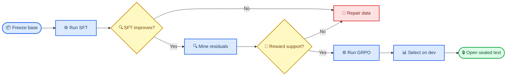

# CAPA SFT → GRPO 后训练实战手册

_目标：训练 Qwen3.5-4B，并在预注册的实体隔离 residual benchmark 上与 Qwen3.5-35B-A3B 做同协议比较 · 最后验证：2026-07-16_

---

## 📋 你会学会什么

这份手册不是“把训练命令跑通”，而是教你完成一条可以相信的后训练证据链：先证明 SFT 相对 base 有增益，再定位 SFT 后仍然会错、同时又能采到不同 reward 的场景，最后只在这些场景上做受门禁保护的 GRPO。

完成整套流程后，你应该能回答四个问题：

- SFT 的提升是否来自同一评测协议，而不是换了数据或 prompt
- GRPO batch 是否真的有组内 reward 方差和可学习的正确动作
- GRPO 是否超过 SFT initializer，同时没有破坏稳定性 control
- 4B 是否在一次性 sealed test 上超过固定的 35B reference



## 🎯 先冻结“超过”的含义

模型比较必须在训练前固定，否则训练后总能找到一个好看的切片。

| 合同项 | CAPA 当前约定 |
| --- | --- |
| 目标模型 | `Qwen3.5-4B` |
| SFT initializer | `planner_retry_migrate_v6` 的 `checkpoint-100` |
| 工程下界 | raw `Qwen2.5-7B-Instruct`；4B 在旧评测上已超过它 |
| 正式大模型 reference | `Qwen3.5-35B-A3B` gateway |
| 独立重复单位 | `entity_id`，不是同一 prompt 的多次 generation |
| 主指标 | core residual 的完整轨迹全规则通过率 |
| 安全指标 | control 完整轨迹率、错误副作用动作、JSON、截断 |
| 推理协议 | 同一 case、Planner prompt、状态机、verifier；`temperature=0` |
| 图片协议 | 路径保留在上下文，像素不发送给 Planner；视觉由 detector 负责 |
| 最终声明 | 只声明在预注册 CAPA residual benchmark 上超过 reference |

> 📌 **关键区别：**“4B 比 35B 更好”是泛化过度；“4B-GRPO 在冻结的 retry/migrate residual benchmark 上高于 35B reference”才是结果支持的范围。

## 📚 正确设计数据隔离

每个 split 必须使用不同实体、项目名、目标物、fixture、错误别名和格式化 prompt hash。推荐至少保留以下四层：

| Split | 用途 | 能否更新权重 | 能否选 checkpoint |
| --- | --- | :---: | :---: |
| `grpo_train` | GRPO optimizer 数据 | 是 | 否 |
| `support_dev_a/b` | 两个独立多采样 reward 支持块 | 否 | 否 |
| `selection_dev` | SFT/GRPO checkpoint 选择 | 否 | 是 |
| `sealed_test` | 最终一次确认和大模型比较 | 否 | 否 |

实验单位是实体。一个实体下的 Qwen/Rex、不同状态反事实和四次 stochastic generation 都是相关测量，不能把它们当成独立样本。query style、badge、fixture、detector、error alias 应在实体块内完整或平衡交叉；生成顺序使用固定 seed 随机化。

每次 build 后至少检查：

```bash
# 数据、实体、prompt 和 sealed commitment 审计
.venv-train/bin/python \
  training/planner_grpo_seed_v1/scripts/build_planner_retry_safe_end_hard_residual_v9.py

git diff --check
```

## ⚙️ 阶段一：用 SFT 建立正确动作支持

SFT 负责教会模型格式、动作名、参数复制、停止条件和基本状态机。GRPO 不适合从“正确动作几乎采不到”的状态开始，因为同一组 generation 中没有正向样本可比较。

CAPA 已完成的 V6 证据是：同一实体隔离 SFT-dev 上，base action accuracy 为 `77.31%`，checkpoint-100 为 `97.69%`，提升 `20.38` 个百分点。这个结果证明 SFT 阶段有效，也固定了后续 GRPO initializer。

SFT 的正确检查顺序：

1. 在训练前冻结 train/dev、tokenizer、chat template 与 checkpoint 选择指标
2. 训练时记录 loss、token accuracy、learning rate、gradient norm 和非有限值
3. 在同一 dev 上比较 base、候选 checkpoint，不比较 test
4. 按预注册主指标选择一次 checkpoint
5. 保存 adapter、数据和配置 SHA-256

> ⚠️ **常见错误：**训练 loss 降到接近零不等于策略变好。必须用 held-out entity 的动作、参数和完整轨迹指标确认。

## 🔍 阶段二：挖掘适合 GRPO 的 residual

适合 GRPO 的场景要同时满足三个条件：SFT 仍有错误、正确动作能被随机采到、同一 prompt 的多个 completion reward 不完全相同。

对每个 prompt 采样 `G=4` 次，记 reward 为 `r₁…r₄`。若四个 reward 完全相同，组内标准差为零，归一化 advantage 也没有有效排序信号。此时硬跑 optimizer 只会制造“训练过”的假象。

CAPA 的两次失败很有教学价值：

| 版本 | 发现 | 正确动作 |
| --- | --- | --- |
| V6 | 只有 `2/180` 组有非零方差 | 不训练，重建 residual 数据 |
| V7 | 主 residual 方差率 `24.31%`，但 gold support 仅 `76.39%` | 不放宽 80% 门槛，不训练 |
| V8 | 选定场景 gold support `93.06%`，但方差仅 `1/72=1.39%` | 不训练；恢复困难措辞并新建 V9 |

V7 的 4B-SFT/35B exploratory pilot 冻结了三个场景：`current_success_step2`、`fresh_retry_step2`、`post_retry_success_step3`。它们同时满足两点：V7 随机采样仍有可用方差；35B 在完整轨迹上存在明显弱点。该 pilot 只能选场景，不能证明最终超过 35B；正式结论必须来自新实体的 V9 sealed test。

V8 还揭示了另一个极端：把规则改写得过于直接后，模型几乎总是给出同一动作。正确率高不等于适合 GRPO；没有组内方差时 advantage 仍为零。V9 因此保留 V7 的自然故障/预算干扰措辞，并把 support 扩为两个独立的 12-entity block。

### 先校准采样，不用 test 调参

V9 在生成新数据前，只用已经公开的 V7 最弱层 `post_retry_success × Rex` 比较温度 0.9 与 1.0。选择规则提前固定为：gold support ≥70%、方差率 ≥25% 的最低温度；两者都失败则回退 0.7。结果如下：

| 温度 | gold support | 非零方差率 | 结论 |
| ---: | ---: | ---: | --- |
| 0.9 | 83.33% | 25.00% | 通过并按最低温度规则选中 |
| 1.0 | 83.33% | 33.33% | 通过，但不选 |

这种校准可以决定训练采样分布，但不能进入最终效果证据链。对应的预注册、结果和文件哈希保存在 `experiments/studies/planner_retry_safe_end_hard_residual_v9_qwen35_4b_v1/`。

## 🧪 阶段三：在 optimizer 前执行硬门禁

支持度审计必须使用训练时相同的 temperature、top-p、completion 上限和 initializer，但使用独立 `support_dev`。建议门禁至少包括：

| 门禁 | 作用 |
| --- | --- |
| 样本与 prompt 组完整 | 排除掉卡、重复或漏样本 |
| JSON ≥99% | 确保 reward 不是格式噪声 |
| 截断 ≤1% | 避免把长度上限误当策略错误 |
| gold action support | 每组至少有机会采到正确动作 |
| 非零 reward 方差率 | 保证 GRPO 存在组内排序信号 |
| detector 分层最小组数 | 防止总体均值掩盖 Qwen/Rex 单侧失效 |

门禁失败时，optimizer steps 必须保持为零。允许的动作是新建版本、增加 SFT 或更换独立场景；不允许原地重采、删除不利样本或事后降低阈值。

V9 最终得到 `576/576` 完整样本、`80.56%` gold support 和 `36.11%` 非零方差；六个场景×detector 层与 A/B 两个 block 全部通过。因此这是本项目第一个真正授权 optimizer step 的 residual 版本。

V9 的可执行顺序是：

```bash
# 1. 生成 train、两个 support block、selection，并只提交 sealed hash
.venv-train/bin/python \
  training/planner_grpo_seed_v1/scripts/build_planner_retry_safe_end_hard_residual_v9.py

# 2. 四卡 support sampling 完成后，合并并原子执行全部门禁
scripts/finalize_qwen35_4b_v9_support.sh

# 3. 只有 support_decision.json=pass 且 optimizer data 已冻结后才会启动
RUN_MODE=canary scripts/run_qwen35_4b_retry_safe_end_hard_v9_grpo.sh
RUN_MODE=screen scripts/run_qwen35_4b_retry_safe_end_hard_v9_grpo.sh
```

## ⚙️ 阶段四：先 canary，再做 GRPO screen

通过支持门禁后，先运行 5 个 optimizer step。canary 只回答“训练系统和梯度健康吗”，不回答“模型最终提升了吗”。

CAPA 的 4 卡拓扑固定为：

| 参数 | 值 |
| --- | ---: |
| GPU ranks | 4 |
| 每卡 batch | 1 |
| `num_generations` | 4 |
| `generation_batch_size` | 4 |
| gradient accumulation | 8 |
| 每 optimizer step completion 数 | 32 |
| 初始 learning rate | `5e-6` |

canary 的停止条件：任意非有限 loss/reward/gradient/parameter、trainable gradient 缺失、单卡峰值超过 28 GiB、空闲显存低于 2 GiB，或四类核心 W&B 遥测缺失。

canary 健康后才进入有上限的 screen，例如 40–100 steps，并在预先固定的 checkpoint 上做 `selection_dev` 评测。不要观察一条曲线后临时延长训练；最大 steps 和候选 checkpoint 必须在启动前写入 preregistration。

## 📊 如何阅读 W&B，而不是只看 loss

| 看板 | 你要判断什么 | 危险信号 |
| --- | --- | --- |
| Train Reward Statistics | reward 均值、最小/最大值是否移动 | min=max，长期无组内差异 |
| Policy Entropy | 策略探索是否过快坍缩 | 快速降到极低且 reward 未提升 |
| Gradient Norm | 是否存在稳定有效更新 | 长期为零、非有限或持续爆炸 |
| Mean Advantage Estimate | batch 内是否有相对偏好信号 | 长期完全为零或遥测缺失 |

还要同时看 JSON、clipped ratio、各 reward component 和场景分层。reward 上升但 control 下降，通常表示模型学到捷径，而不是学会状态机。

## ✅ 阶段五：开发集选择与 sealed test

checkpoint 选择只能使用 `selection_dev`，并先比较 4B-SFT 与 4B-GRPO：

1. GRPO core residual 完整轨迹率必须高于 SFT
2. control 不得超过预注册退化容忍度
3. JSON、截断和错误副作用动作必须过门
4. 满足条件的 checkpoint 按固定排序规则选一次

checkpoint 冻结后才物化 sealed test，并对 4B-SFT、选中的 4B-GRPO 和 35B reference 各跑一次固定协议。主结果是 entity-level paired difference；case-level 结果用于诊断，不能把同一实体下的多个反事实当成独立重复。

如果 4B-GRPO 的点估计高于 35B，但 entity bootstrap 置信区间跨零，可以报告“本次点估计超过”，不能报告“已稳定优于”。如果未超过，test 仍然只运行一次，下一版必须使用新 test。

## 🔧 常见失败与处理

### SFT 提升，但 GRPO 没有方差

**原因：**GRPO 数据与 SFT 数据太相似，initializer 已饱和。

**处理：**用独立实体做 residual mining，寻找错误率不为零且正确动作仍有采样支持的场景。

### reward 有方差，但 gold support 不足

**原因：**模型在随机采样中会变化，但大多变化都是不同的错误动作。

**处理：**补小规模 residual SFT，或把该场景移到独立版本；不能仅凭方差启动 GRPO。

### reward 上升，完整轨迹不升

**原因：**step reward 与最终目标不一致，或者后续状态 transition/stop 被破坏。

**处理：**用完整轨迹作为主选择指标，并把 step reward 降级为训练诊断指标。

### 4B 超过 7B，但没有超过 35B

**原因：**7B 是过低的工程下界，不能作为有意义的最终目标。

**处理：**保留 7B 用于 sanity check，正式结论使用训练前固定的 35B reference 和同一 sealed benchmark。

## 🚀 当前项目位置

| 阶段 | 状态 | 证据 |
| --- | --- | --- |
| SFT 增益 | 完成 | [V6 training report](../experiments/studies/planner_retry_migrate_v6_qwen35_4b_v1/TRAINING_REPORT.md) |
| W&B 遥测 | 完成 | `configs/wandb/post_training_v1.json` |
| V7 support pilot | 完成，门禁失败 | [V7 support result](../experiments/studies/planner_retry_migrate_residual_v7_qwen35_4b_v1/SUPPORT_GATE_RESULT.md) |
| 35B/4B 场景筛选 | 完成，仅作探索 | `experiments/studies/planner_retry_migrate_residual_v8_qwen35_4b_v1/v7_pilot_decision.json` |
| V8 support | 完成，方差门禁失败 | `experiments/studies/planner_retry_migrate_residual_v8_qwen35_4b_v1/support_decision.json` |
| V9 温度校准 | 完成，固定 0.9 | `experiments/studies/planner_retry_safe_end_hard_residual_v9_qwen35_4b_v1/temperature_calibration_decision.json` |
| V9 数据与 sealed commitment | 完成 | `data/datasets/planner_retry_safe_end_hard_residual_v9/manifest.json` |
| V9 support | 完成，全部门禁通过 | `experiments/studies/planner_retry_safe_end_hard_residual_v9_qwen35_4b_v1/SUPPORT_GATE_RESULT.md` |
| GRPO optimizer data | 已授权并冻结 144 条 | `training/planner_grpo_seed_v1/step_data/planner_retry_safe_end_hard_residual_v9_optimizer_qwen35_4b_nothinking_mixed_steps.manifest.json` |
| GRPO canary | 完成，5/5 steps 健康 | `experiments/studies/planner_retry_safe_end_hard_residual_v9_qwen35_4b_v1/canary_decision.json` |
| GRPO screen | 已授权，待运行 | 从同一 SFT initializer 重新启动 40 steps；候选 checkpoint 固定为 10/20/40 |

后续每次实验都应更新这张表，并把命令、数据 SHA-256、门禁结论和 Git commit 一起保存。这样你学到的不只是一次训练，而是一套能审计、能复现、也能知道何时不该训练的流程。
