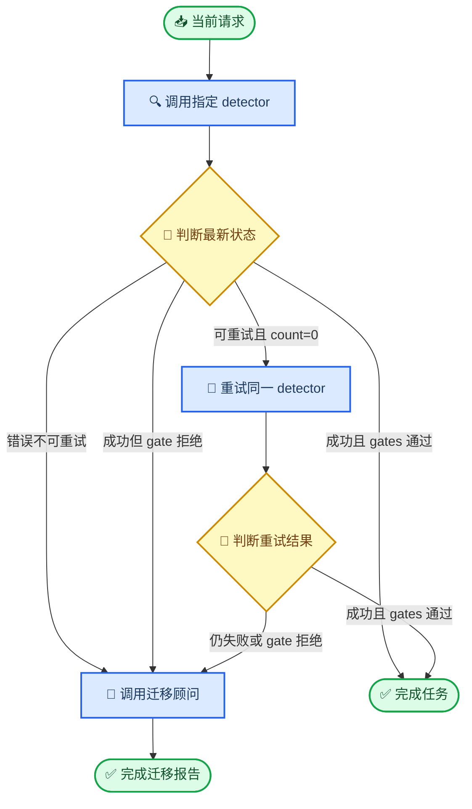

# Qwen3.5-4B V5 train-v1 数据与实验设计审计

_CAPA Planner · 2026-07-15 · `DATA_AUDIT_COMPLETE / NO_OPTIMIZER_STEP / REBUILD_BEFORE_SFT`_

---

## 📋 结论摘要

当前最新结果不是训练后结果，而是 base `Qwen3.5-4B` 在
`planner_multistep_grpo_value_v5_train_v1` 上的训练前 stochastic-support 审计。
仓库和 artifact store 中没有该任务的 checkpoint、adapter、`trainer_state.json` 或训练
summary；三个 run 均为 `optimizer_steps_authorized=false` 的 dry-run。G0–G2 证明环境、
模型加载、LoRA 覆盖、最长序列 forward/backward 可以工作，但 support gate 失败，实际
optimizer step 为 0。

真实数据表明当前不能直接开始 GRPO，也不应直接把现有 480 条数据转成 SFT：

1. base 在 stochastic sampling 下对 migrate 已接近饱和，但 retry 支持不足，尤其 Rex retry；
2. V5 confirmation 存在 `overall_badge -> action` 的完美捷径，不能继续作为最终 sealed test；
3. V5 与 train-v1 都让每个 entity/query block 只对应一种动作，没有同实体、同题面下的
   状态反事实；
4. 当前 retry 轨迹在第二次 detector 调用后以 `finish_after_tool=false` 截断，并不是完整任务；
5. step-level reward 对合法 retry canonical gold 的最高分只有 `0.916667`，与 migrate 的
   `1.0` 不对称；
6. 全部 480 个训练 prompt 都暴露 case ID、绝对文件路径和训练专用 thought，并且只有 step 2、
   `max_steps=10` 一种上下文形态。

正确顺序应为：先修 reward 和任务状态机，重建 bundle-matched 且 component-disjoint 的
SFT/GRPO/dev/V6-test 数据；再做最短 SFT；冻结同一个 initializer；重新做无训练 support
gate；只有通过后才启动 GRPO。

## 🔬 审计范围与真实运行状态

### 审计范围与数据来源

本审计读取：

- V5 confirmation：240 cases；
- V5 train-v1：480 cases / 60 entity groups / 960 decisions；
- Qwen3.5 native non-thinking step-2 数据：480 rows；
- 固定 support pool：80 groups / 60 entities；
- base policy sampling：每组 8 次，共 640 samples；
- V5 confirmation 的 Qwen3.5-4B deterministic baseline；
- G0、G1、G2、dry-run 与 reward 实现。

关键冻结 hash：

| 产物 | SHA256 |
|---|---|
| train-v1 cases | `bc7d50c69eb710442065a53d37f6202dc5952ae110e0d45406c62f40f48ba258` |
| step-2 data | `d84bf1681337603aebc0f2f169340c2dbd82f7faee5217ea60ba16de087f782d` |
| support80 | `f24debec5ecc8b428afe3d8583626b01435c42af2e3f9313ee949650dcb957dc` |
| support samples | `3cda50a0150900892224cf46da6dca6ba5d3cd04a8df5cc5d6eadaa43316d0c5` |
| V5 confirmation | `ce93598667167c2ae3d0cdf69e303fec0652e5719923728cd8eb806d1eaa17e3` |

### “训练结果”的真实状态

| 阶段 | 结果 | 能证明什么 | 不能证明什么 |
|---|---|---|---|
| G0 | pass | 冻结环境与 Qwen3.5 模板可解析 | 模型可训练、GRPO 有效 |
| G1 | pass | 32/512/4096 token forward finite | 完整 GRPO generation/backward 稳定 |
| G2 | pass | 4319+320 token、152 LoRA modules、304 gradient tensors finite | optimizer 更新有效、8-rank 分发正确 |
| support80 | fail | base sampling 的动作支持与长度问题 | 训练后性能 |
| dry-run | prepared | 参数和数据可加载 | 任何一次训练更新 |

G2 的最长序列为 4639 tokens，峰值 allocated `14.6584 GiB`，无 non-finite gradient，
LoRA trainable parameters 为 `14,376,960`。这些是工程可行性证据，不是学习效果证据。

## 📊 Support 数据的重新统计

Sampling 配置为 `temperature=0.7`、`top_p=0.9`、每题 8 次、320 new tokens。
640 次 sample 是嵌套在 80 个 prompt、60 个 entity 中的技术重复，不能当作 640 个独立
实验单位。

### 动作支持

| 目标动作 | Groups | Sample exact action | 至少一次正确 | 零支持 group |
|---|---:|---:|---:|---:|
| migrate | 48 | 361/384 = 94.01% | 48/48 = 100% | 0 |
| retry | 32 | 64/256 = 25.00% | 18/32 = 56.25% | 14/32 = 43.75% |

Retry 再按 detector 分解：

| Retry detector | 正确 samples | 总 samples | Exact-action rate |
|---|---:|---:|---:|
| Qwen | 52 | 128 | 40.63% |
| Rex-Omni | 12 | 128 | 9.38% |

全体预测动作分布中，`migration_advisor` 为 550/640（85.94%）；这不是一个处在
retry/migrate 边界附近的均衡 policy，而是强烈偏向 migration 的 policy。

每组 8 次正确样本数分布为：

| 正确次数 | Groups |
|---:|---:|
| 0 | 14 |
| 1 | 5 |
| 2 | 3 |
| 3 | 2 |
| 4 | 3 |
| 5 | 2 |
| 6 | 6 |
| 7 | 10 |
| 8 | 35 |

这是一种两极分布，而不是大多数 prompt 都有可学习的组内排序信号。

### Reward 方差并不等于 route 方差

80 个 group 中 69 个 reward std 非零，但其中 37 个 group 只有一种有效 action。即
`37/69 = 53.62%` 的“非零 reward 方差”没有伴随 action 变化，主要来自参数文本、格式尾部
或截断差异。对当前研究问题而言，这类方差会优化输出形式，而不是 retry/migrate 路由。

Migrate 的 `mean_distinct_valid_actions=1.0`，且 33/48 groups 的 8 次采样全部处于高分区。
因此当前 288 条 migrate 不能继续作为 GRPO 主学习分布。

### 长度与格式

- 25/640（3.91%）没有在 320 tokens 内自然产生 EOS；
- migrate 为 23/384（5.99%），retry 为 2/256（0.78%）；
- 320-token 统计存在右删失，当前 `p99=320` 不能解释为真实 p99；
- 另有 25 个 `invalid` 和 1 个 `missing_action`，共 26/640（4.06%）无有效动作。

在新数据冻结后，应先用 384/512 tokens 做全分布无训练长度探针，再决定 SFT/GRPO 的生成
上限；不能用单个 longest-prompt probe 替代 completion 分布审计。

## ⚠️ V5 confirmation 不是正确的最终测试集

### Badge 是完美标签捷径

V5 confirmation 中：

| overall_badge | retry | migrate | 由 badge 预测 action 的准确率 |
|---|---:|---:|---:|
| red | 96 | 0 | 100% |
| amber | 0 | 144 | 100% |

`badge` 与动作的 normalized mutual information 为 1.0。尽管题面要求忽略 badge，任何模型
仍可合法读取该 token 并绕开 `retryable/retry_count`。因此 V5 的 100% route 上界并不能证明
模型学会了目标状态机。

Train-v1 已把 badge 基本解耦：单独用 badge 的最优多数类准确率为 60%，normalized mutual
information 约 0.007。这一修正是对的，但也意味着 train-v1 与 V5 在最重要的 nuisance
相关结构上并不同分布。

### 没有同实体反事实

V5 confirmation 的 30/30 entities、train-v1 的 60/60 entities 都只对应单一目标动作；
`(entity, detector, error_alias)` bundle 中同时含 retry 和 migrate 的数量也是 0。

因此：

- entity/query 在各自数据内部都能 100% 预测动作；
- 480 cases 不是 480 个独立状态边界，train-v1 只有 60 个 entity clusters；
- SFT 可以记住项目实体或 query block，而不需要比较同一任务下的状态变化；
- 无法计算真正的 paired counterfactual consistency。

测试实体不与训练实体交叉仍然必要，但不足以证明状态泛化。正确设计必须让同一个 bundle
内部出现不同动作，并把整个 bundle 分配到同一个 split。

### Retry 轨迹被截断

V5 retry case 的序列是：

```text
detector(finish=false) -> detector retry(finish=false) -> evaluation stops at max_steps=2
```

第二次 detector 仍声明不能结束，但数据没有提供第二次 observation 和第三步决策。因此当前
所谓 strict full trajectory 实际只评估到“是否选择 retry”，不是完成用户任务。

### V5 已经参与开发决策

V5 的分布、base failure、35B/4B gap 已直接指导 train-v1、support gate 和下一版数据设计。
即使没有逐行复制，它也不再是对后续 SFT/GRPO 的 untouched final test。合理定位是：

- 历史 regression / diagnostic；
- 可报告 post-training 结果，但不能作为唯一 promotion 或因果证据；
- 新建从未用于当前开发决策的 V6 sealed test。

## 🔍 Train-v1 与 reward 的结构缺陷

### Train-v1 不能原样作为 SFT 数据

Train-v1 的题族、动作边际、alias 和 fixture 隔离是合格的，但 prompt/trajectory 结构仍有
以下问题：

| 检查 | 结果 |
|---|---:|
| step rows | 480 |
| unique prompts | 480 |
| prompt token range | 4300–4319 |
| prompt 含 case ID | 480/480 |
| prompt 含绝对项目路径 | 480/480 |
| prompt 含“按训练样本期望执行该工具” | 480/480 |
| current step | 全部为 2 |
| max_steps | 全部为 10 |
| 独立 dev split | 无 |

模型输入中的 `session_id/thread_id/query_id/external_ref` 都携带 synthetic case ID 或
`/raid/...` 绝对路径。这些字段不是目标策略的一部分，应在训练前删除或替换为与 action
独立的随机 opaque IDs。前一步 `_thought="按训练样本期望执行该工具"` 也应改为生产风格
或不进入 observation。

此外，step-data 的 `max_steps=10` 与 V5 formal eval 的 `max_steps=2` 不一致。真正状态机应
显式支持 2–3 步，而不是依赖不同的硬上限截断。

### 当前 step reward 存在类别不对称

对全部 480 个 step-2 row 使用各自 canonical gold 重新打分：

| Target | Canonical rows | Canonical task reward |
|---|---:|---:|
| migrate | 288 | 1.000000 |
| retry | 192 | 0.916667 |

原因是 step scorer 在 `current_step == total_steps` 时无条件要求 tool 的
`finish_after_tool=true`；合法 retry gold 明确要求 `false`。完整 case scorer 已正确地只对
“期望 final finish=true”的 case 应用该过程奖励，step scorer 与它不一致。

在任何 SFT/GRPO 前必须：

1. 只在 expected final step 明确要求 `finish_after_tool=true` 时加入 `final_tool_finish`；
2. 增加 canonical parity 测试：所有 gold、所有 target action 的最高 reward 都必须为 1；
3. 增加最坏错误分离测试：任一 wrong action 的 reward 必须低于任一正确 action；
4. 分开记录 route、arguments、finish、format，不用单一 reward mean 掩盖类别不对称。

## 🧠 正确任务应先定义为状态机



优化数据可以继续聚焦 step 2，但正式评测必须同时包含：

- oracle-prefix transition：固定正确 step 1，只测 step 2 状态边界；
- full trajectory：真实运行 2–3 步，测完整完成率；
- post-retry transition：确保不会第二次 retry，并能在成功后 end、失败后 migrate。

## 📚 推荐的数据架构

以下数量是第一版工程布局，不是正式 power calculation。独立单位是 entity-level
counterfactual bundle，不是 case 或 rollout sample。

| Split | 建议 entities | 核心三状态 cases | 用途 |
|---|---:|---:|---|
| SFT train | 80 | 480 | 教 schema、完整轨迹和基本状态规则 |
| SFT dev | 20 | 120 | SFT early stop；禁止进入训练 |
| GRPO train | 60 | 360 | SFT 后有组内 route 方差的优化池 |
| GRPO dev | 30 | 180 | 固定 checkpoint step；禁止训练 |
| V6 sealed test | 60 | 360 | 设置、seed、checkpoint 全冻结后一次性确认 |

每个 entity 核心包含 `2 detectors × 3 matched states`：

1. 同 query、同 alias、`retryable=true,retry_count=0` -> retry；
2. 同 query、同 alias、`retryable=false,retry_count=0` -> migrate；
3. 同 query、同 alias、`retryable=true,retry_count>=1` -> migrate。

再增加约 20%–25% guardrails，覆盖：

- 无 error 且 gate 全过 -> end；
- confidence/IoU/domain/candidate 任一 veto -> migrate；
- retry 后成功 -> end；
- retry 后失败 -> migrate；
- 缺字段、类型错误、冲突 observation 的安全处置；
- stale history 与 current observation 冲突。

### Split 隔离

不同 split 必须同时隔离：

- 完整 project entity 以及 site-root / suffix 组成词；
- target label；
- query/template family；
- gateway-error alias；
- fixture path、family 与 SHA256；
- opaque ID namespace；
- counterfactual bundle ID。

所有同 bundle 反事实必须留在同一 split，不能把一个状态放 train、另一个状态放 test。

### Nuisance 随机化

在每个 target action、detector、error family 内，把 badge 分为 aligned、contradictory、missing
三类并平衡；任何 badge 值都必须同时出现 retry 和 migrate。模板、fixture、alias、query
长度和 history 深度也要在动作内分层平衡。

## 🔄 SFT 到 GRPO 的分阶段设计

### SFT 应该怎样做

SFT 的目标不是把任务训练到 100% 后再强行 GRPO，而是建立合法输出和最小 route support。

1. 使用完整 2–3 步 trajectory 生成逐 step SFT rows，不能只有 step 2；
2. retry 可以增加 sampling weight，但复制行只算权重，不能宣称增加独立样本；
3. canonical completion 应简洁，migration `user_query` 保留项目实体与需求，不复制整段 prompt；
4. 只在 SFT dev 上 early stop；V5/V6 test 不参与选 epoch 或学习率；
5. 冻结一个 SFT initializer hash，SFT-only control 与所有 GRPO arms 从同一权重开始。

SFT 后、GRPO 前重新执行 support gate。建议按 retry/migrate 对称检查：

- 每类 exact-action support rate >= 0.80；
- 每类 zero-support rate <= 0.05；
- 至少 60% 的 GRPO groups 正确 action 采样率在 0.20–0.80；
- route-changing reward std rate >= 0.60，不能把纯格式方差计入；
- fully saturated rate <= 0.25；
- clipping <= 1%；
- canonical reward parity = 1.0/1.0。

如果最短 SFT 后 GRPO pool 大面积饱和，应停止 GRPO，而不是为了训练而继续造 reward 方差。

### GRPO 应该怎样做

- 优化单元以 step-2 boundary 为主，但从完整轨迹构造真实上下文；
- sampler 对 retry/migrate、Qwen/Rex、error family 分层，不按原始 60/40 直接抽样；
- 当前最需要学习的是 Rex retry，但 primary/anchor 身份应在 SFT 后重新测量并冻结；
- migrate 已饱和样本只保留少量 guardrail；主池应由能同时采到 detector 与 migration 的
  boundary groups 组成；
- route reward 为主，wrong action cap 保留；format 与 argument 不能制造假的 route std；
- completion 上限由无删失长度审计确定；
- 使用同一 frozen initializer 的 SFT-only control 与 GRPO seed 42/43/44；
- seed42 只在 GRPO dev 选择一次统一 checkpoint step，seed43/44 使用同一步。

## 🎯 正确评测指标与训练前硬停止项

### 正确评测指标

主指标不应只是按 60/40 prevalence 计算的 overall accuracy。至少同时报告：

1. `balanced route accuracy`：retry/migrate 宏平均；
2. `counterfactual bundle pass`：同 bundle 三个状态全部正确；
3. `full trajectory strict pass`：所有动作、参数、finish flag 和终态都正确；
4. `post-retry completion`：retry 后能正确 end 或 migrate；
5. `nuisance invariance`：badge flip / removal 不改变应有动作；
6. `forbidden side-effect rate`；
7. argument exact 与 format valid，作为独立 secondary metrics。

置信区间以 entity/bundle 聚类 bootstrap；三个训练 seed 是方法复现，不能把每个 prompt 的 8 次
sampling 当作独立 n。V5 仅作为 legacy regression，V6 sealed test 才承担最终 confirmation。

### 在任何训练前的硬停止清单

1. 修复 retry canonical reward 只能到 0.916667 的 bug并增加单测；
2. 冻结新版状态机和 terminal semantics；
3. 重建 SFT train/dev、GRPO train/dev 和 V6 sealed test；
4. 删除 prompt 内 case ID、绝对路径和训练专用 thought；
5. 自动验证 bundle 内同时包含 retry/migrate，badge 与动作不相关；
6. 对所有 split 做 component-level overlap audit；
7. 用 384/512 做无训练 completion length audit；
8. 先 SFT，冻结 initializer，再做新的 support gate；
9. support gate 通过前保持 `optimizer_steps=0`。

## 🔗 关键证据文件

- `experiments/studies/planner_multistep_tool_routing_grpo_qwen35_4b_v1/SUPPORT_GATE_RESULT_20260715.md`
- `experiments/studies/planner_multistep_tool_routing_grpo_qwen35_4b_v1/support320/gate.json`
- `experiments/studies/planner_multistep_tool_routing_grpo_qwen35_4b_v1/support320/combined/summary.json`
- `experiments/studies/planner_multistep_tool_routing_grpo_qwen35_4b_v1/support320/combined/groups.jsonl`
- `experiments/studies/planner_multistep_tool_routing_grpo_qwen35_4b_v1/support320/combined/samples.jsonl`
- `training/planner_grpo_seed_v1/step_data/planner_multistep_grpo_value_v5_train_v1_qwen35_4b_nothinking_step2.manifest.json`
- `training/planner_grpo_seed_v1/scripts/train_planner_grpo.py`
- `/raid/zkq/artifacts/CAPA/evals/20260715_planner_multistep_grpo_value_v5/confirmation/qwen35_4b_combined/qwen35_4b_v5_confirmation_t1024_aggregate.json`

Training status: **not started; data/reward redesign required before SFT**.
