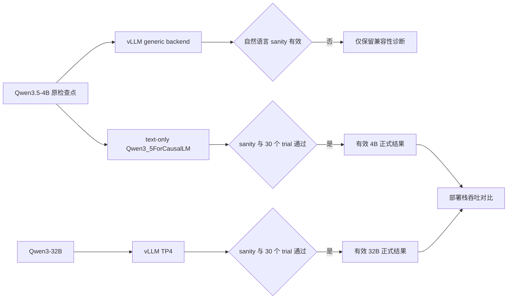

# Qwen3.5-4B 与 Qwen3-32B 在 V100 上的吞吐对比

## 结论

**在本机可验证的部署栈和同步负载下，单卡 Qwen3.5-4B 的总输出吞吐在所有六个测试条件中
均高于四卡 TP 的 Qwen3-32B；并发/batch 16 时，短输入高 1.40 倍，长输入高 1.72 倍。**

最适合直接发布的结果如下。括号内为对 5 个独立 trial 做 20,000 次 bootstrap 得到的
95% CI。

| ISL/OSL | 同步负载 | 4B，1×V100 | 32B，4×V100 TP | 4B/32B 总吞吐比 | 4B/32B 每 GPU 比 |
|---:|---:|---:|---:|---:|---:|
| 256/128 | 16 | **207.22** [205.33, 209.45] tok/s | 148.00 [146.09, 149.91] tok/s | **1.40×** [1.38, 1.42] | **5.60×** |
| 2,048/128 | 16 | **103.49** [103.43, 103.56] tok/s | 60.17 [59.56, 60.79] tok/s | **1.72×** [1.70, 1.74] | **6.88×** |

这是一项**部署栈对比**，不是纯模型参数量实验。4B 使用 Transformers 同步静态 batch，
32B 使用当前可稳定运行的 vLLM continuous batching / TP4。模型代际、架构、引擎和调度器
都不同，因此不能写成“所有环境下 4B 天生比 32B 快”。

推荐发布措辞：

> 在 Tesla V100-SXM2-32GB 节点上，采用 FP16、固定 128-token 输出和同步 batch/并发 16，
> 单卡 Qwen3.5-4B Transformers 静态 batch 在 256 与 2,048-token 输入下分别达到
> 207.2 和 103.5 output tok/s；Qwen3-32B vLLM TP4 分别为 148.0 和 60.2 tok/s。
> 4B 的总吞吐为 32B 的 1.40 倍和 1.72 倍，每 GPU 吞吐为 5.60 倍和 6.88 倍。
> 该结论限定于所记录的硬件、精度、推理引擎与同步工作负载。

## 完整吞吐表

4B 的“并发”是同步静态 batch size；32B 的“并发”是同时到达 vLLM 的 HTTP 请求数。
每个 trial 都包含两个 wave，总请求数均为 `2 × C`。

| ISL/OSL | C | 4B output tok/s（95% CI） | 32B output tok/s（95% CI） | 4B/32B 总吞吐比（95% CI） | 每 GPU 比 |
|---:|---:|---:|---:|---:|---:|
| 256/128 | 1 | **14.33** [14.22, 14.43] | 11.65 [11.19, 12.00] | **1.23×** [1.19, 1.28] | 4.92× |
| 256/128 | 4 | **55.42** [54.91, 55.94] | 44.28 [43.50, 45.06] | **1.25×** [1.23, 1.28] | 5.01× |
| 256/128 | 16 | **207.22** [205.33, 209.45] | 148.00 [146.09, 149.91] | **1.40×** [1.38, 1.42] | 5.60× |
| 2,048/128 | 1 | **13.79** [13.67, 13.92] | 10.53 [10.41, 10.66] | **1.31×** [1.29, 1.33] | 5.24× |
| 2,048/128 | 4 | **46.33** [46.07, 46.59] | 30.52 [30.24, 30.83] | **1.52×** [1.50, 1.53] | 6.07× |
| 2,048/128 | 16 | **103.49** [103.43, 103.56] | 60.17 [59.56, 60.79] | **1.72×** [1.70, 1.74] | 6.88× |

所有比值区间的下界都大于 1。这里的区间描述本机短时重复性，不代表跨机器或跨软件版本的
总体区间。

## 延迟、功率与能效

| ISL/OSL | C | 4B P95 完成延迟 | 32B P95 E2E | 4B GPU 功率 | 32B GPU 总功率 | 4B kWh/M output tok | 32B kWh/M output tok |
|---:|---:|---:|---:|---:|---:|---:|---:|
| 256/128 | 16 | **10.10 s** | 14.57 s | 177.1 W | 589.4 W | **0.237** | 1.106 |
| 2,048/128 | 16 | **19.81 s** | 34.56 s | 231.0 W | 631.5 W | **0.620** | 2.915 |

在 C=16 下，4B 的估计 GPU 能耗/百万输出 token 比 32B 低 78.5%（短输入）和 78.7%
（长输入）；output tok/s/W 分别高 4.66 倍和 4.70 倍。功率来自每 0.5 秒一次的
`nvidia-smi` 设备采样，只覆盖 GPU，不覆盖 CPU、磁盘和整机冷却。

4B 静态 batch 没有流式请求层，因此未测有效 TTFT，不能与 32B 的 TTFT 排名。表中的 4B
完成延迟是一个同步 batch 内每条序列共同等待的 wave 时间；32B 是请求端流式 E2E。两者都
包含模型计算，但服务语义不完全相同。

## 实验设计

### 硬件

- 8 × Tesla V100-SXM2-32GB，Driver 550.163.01，compute capability 7.0；
- 4B 使用物理 GPU 0；32B 使用同一 NUMA 域的物理 GPU 0–3；
- 40 个物理 CPU core、503.76 GB RAM；
- 两个模型顺序运行，没有共享 GPU 或同时施压。

### 有效部署

| 字段 | Qwen3.5-4B | Qwen3-32B |
|---|---|---|
| 检查点 | text-only `Qwen3_5ForCausalLM` 导出，4,205,751,296 参数 | `/raid/zkq/models/Qwen3-32B-vllm` |
| 精度 | FP16 | FP16 |
| GPU | 1 × V100 | 4 × V100，TP=4 |
| 引擎 | Transformers 5.13-dev，静态 batch，SDPA | vLLM 0.8.5.post1 V0，XFormers |
| PyTorch | 2.8.0+cu128，单卡 | 2.6.0+cu124，多卡 |
| 可选快速 kernel | FLA/causal-conv1d 未安装，回退 PyTorch | FlashAttention-2 不支持 V100，使用 XFormers |
| 请求语义 | 两个同步 batch wave | 两个 concurrent HTTP wave |

4B text-only 导出不是重训或量化：它通过 `AutoModelForCausalLM` 从原检查点选择语言策略，
加载 missing、unexpected、mismatched 和 error keys 全为 0，不含 visual module。自然语言
sanity 输出为正常英文句子，token unique ratio 为 0.933。

### 工作负载与统计

- 精确 ISL：256、2,048 tokens；固定 OSL：128 tokens；
- C：1、4、16；每个 trial 两个 wave；
- greedy 解码、忽略 EOS，所有序列严格生成 128 tokens；
- prefix 不复用；prompt 由固定自然语言语料生成，每个请求不同；
- 每模型 6 个条件 × 5 个随机区组 = 30 个正式 trial；
- 每模型 420 个请求、53,760 completion tokens；
- 吞吐的推断单位是 trial，不把同一 trial 的请求或 token 当作独立重复；
- 20,000 次 trial-level percentile bootstrap，seed `20260721`。

两个有效模型均为 30/30 trial、420/420 请求成功，prompt/completion token mismatch 为 0，
遥测错误为 0。4B 各条件 CV 为 0.08%–1.30%，32B 为 1.29%–4.36%。

## 有效性审计：为什么没有采用 4B vLLM 数字



踩坑过程及判定如下：

1. 本机旧 vLLM 0.8.5 不能直接初始化 Qwen3.5 generic backend；项目中的 vLLM 0.10.2
   可以启动。
2. 为 vLLM 准备的独立 4B 副本只修改 architecture 声明并移除 15 个未使用的 `mtp.*`
   tensor。其余 723 个 tensor 逐一 `torch.equal`，全部与原模型一致。
3. 该 vLLM 服务完成了 30/30 trial，token 数也正确，但 completion 和 chat sanity 均出现
   连续 `user`、编号等重复乱码。**吞吐稳定不等于推理有效**，因此整组降级为 diagnostic。
4. Transformers 原生 continuous batching 随后在 paged-cache 初始化时报
   `Invalid group type: linear_attention`，说明当前实现不支持 Qwen3.5 混合线性注意力。
5. 最终采用已在项目评测中验证的 `Qwen3_5ForCausalLM + SDPA`，并在正式采样前增加输出
   sanity gate。该路径通过后才生成本文 4B 数据。

这一过程也是本实验最重要的工程经验：**服务返回 200、输出长度正确、GPU 跑满，仍不足以
证明吞吐数据可发布；必须至少保留一组可人工阅读的语义 sanity check。**

## 能发布什么，不能发布什么

可以发布：

- 本 V100 节点、FP16、所列软件栈下的条件化吞吐；
- 同步负载 C=1/4/16 下的总吞吐、每 GPU 吞吐、延迟和 GPU 能耗；
- “4B 有效静态 batch 栈在本实验六个条件均快于 32B TP4 服务栈”。

不能发布：

- “Qwen3.5-4B 在任何推理引擎或 GPU 上都快于 Qwen3-32B”；
- “差异完全来自参数规模”；
- 4B 与 32B 的 TTFT 排名；
- 未测试的并发大于 16 时的饱和吞吐；
- 将无效 vLLM 4B 的 58.7 tok/s 等诊断数字混入主表。

额外限制包括：Qwen3.5-4B 是混合 linear/full attention，Qwen3-32B 是另一代 dense
architecture；V100 不支持 BF16/FlashAttention-2；4B 缺少可选快速 linear-attention
kernel；合成 prompt 不能代表所有业务长度分布；模型加载时间受文件系统 page cache 影响，
未作为比较指标。

## 复现

研究目录：`experiments/studies/qwen3_4b_vs_32b_throughput_v1/`。

有效 4B：

```bash
CUDA_VISIBLE_DEVICES=0 \
PYTHONPATH=demo/vllm_compat:experiments/studies/qwen3_4b_vs_32b_throughput_v1 \
.venv-train/bin/python \
  experiments/studies/qwen3_4b_vs_32b_throughput_v1/benchmark_hf_static_batch.py \
  --model /raid/zkq/artifacts/CAPA/bench_models/Qwen3.5-4B-text-only-fp16 \
  --model-label Qwen3.5-4B-HF-static \
  --prompt-pool experiments/studies/qwen3_4b_vs_32b_throughput_v1/prompts_4b.json \
  --output experiments/studies/qwen3_4b_vs_32b_throughput_v1/raw_4b_hf_static_formal.json \
  --run-id qwen35-4b-hf-static-formal-20260721 \
  --phase formal --gpu-indices 0
```

32B 服务与客户端：

```bash
experiments/studies/qwen3_4b_vs_32b_throughput_v1/serve_32b.sh

.venv-train-cu124/bin/python \
  experiments/studies/qwen3_4b_vs_32b_throughput_v1/benchmark_openai_throughput.py \
  --model qwen3-32b-bench --model-label Qwen3-32B \
  --prompt-pool experiments/studies/qwen3_4b_vs_32b_throughput_v1/prompts_32b.json \
  --output experiments/studies/qwen3_4b_vs_32b_throughput_v1/raw_32b_formal.json \
  --run-id qwen3-32b-formal-20260721 --phase formal --gpu-indices 0 1 2 3
```

统计：

```bash
.venv-train-cu124/bin/python \
  experiments/studies/qwen3_4b_vs_32b_throughput_v1/analyze_results.py \
  --four-b experiments/studies/qwen3_4b_vs_32b_throughput_v1/raw_4b_hf_static_formal.json \
  --thirty-two-b experiments/studies/qwen3_4b_vs_32b_throughput_v1/raw_32b_formal.json \
  --output-dir experiments/studies/qwen3_4b_vs_32b_throughput_v1/analysis
```

## 审查入口

| 产物 | 用途 |
|---|---|
| `PROTOCOL.md` | 原预注册协议与失效标记 |
| `PROTOCOL_AMENDMENT_VALIDITY.md` | 在替代正式采样前冻结的有效性修订 |
| `raw_4b_hf_static_formal.json` | 有效 4B 请求级、trial 级与 GPU 遥测原始数据 |
| `raw_32b_formal.json` | 有效 32B 请求级、trial 级与 GPU 遥测原始数据 |
| `analysis/SUMMARY_TABLES.md` | 自动生成的全量统计表 |
| `analysis/comparison_summary.csv` | 可直接导入论文/表格工具的模型比较 |
| `analysis/validation_audit.json` | trial、请求、token 和错误数审计 |
| `environment_manifest.json` | 硬件、软件、模型和关键文件哈希 |
| `semantic_sanity_32b.json` | 32B 可读输出与人工语义门记录 |
| `INVALID_VLLM_4B_NOTICE.md` | 无效 4B vLLM 数据隔离说明 |
| `invalid_vllm_4b_semantic_sanity.json` | 无效 4B completion/chat 原文证据 |
| `diagnostic_invalid_4b_vllm_formal.json` | 保留但不得用于主结论的诊断数据 |
